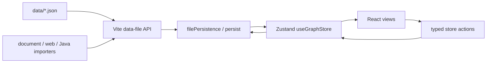

# Knowledge-OS

> 最新状态：2026-09-24 · **本文件为项目唯一文档**：架构、宪法、裁决集、批次规范、导入标准、固定拆分、ADR、领域上下文、分支流程、代理约定与治理状态，已整合为本文一份文档（内容未删改）；全文交叉引用一律用节名。`AGENTS.md` 真身保留在仓库根（见〈代理工作约定〉）。

Knowledge-OS 是一个本地优先的多维知识图谱工作台。它把目录、知识节点、解释索引、问题、类型关系、时间线和机制视图组织在同一套显式数据模型中，适合维护需要持续拆解、关联和回顾的技术知识。

## 目录

- [1. 当前能力](#1-当前能力)
- [2. 快速开始](#2-快速开始)
- [3. 可选模型配置](#3-可选模型配置)
- [4. 部署（Vercel，只读）](#4-部署vercel只读)
- [5. 技术栈](#5-技术栈)
- [6. 目录结构](#6-目录结构)
- [7. 数据真源](#7-数据真源)
- [8. 架构说明](#8-架构说明) — 逻辑分层、数据流、模块边界、导入边界、测试策略、机制视图投影
- [9. 知识库宪法](#9-知识库宪法) — 五原则最高治理原则：新陈代谢与受控删除、目录净化、本体与具象、结构化内展、问答闭环
- [10. 知识治理裁决集（KNOWLEDGE_RULES）](#10-知识治理裁决集knowledge_rules) — 22 条既有裁决速查，每条附判据与反例
- [11. 批次边界声明（Batch Manifest）规范](#11-批次边界声明batch-manifest规范) — writeSet / governanceSet / declaredExternalSet / excludedSet 与两闸正交
- [12. 文档导入标准](#12-文档导入标准) — 普通文档 / 网页与 Wikipedia / Java 源码的统一边界
- [13. 知识点固定拆分研究（Facet Decomposition）](#13-知识点固定拆分研究facet-decomposition) — 16 面 6 组 facet 目录提案
- [14. 决策记录（ADR）](#14-决策记录adr) — ADR-0001 语义导入图优先 · ADR-0002 身份判据与观察纪律
- [15. 领域上下文](#15-领域上下文) — 核心语言、导入原则、不变量
- [16. 开发与分支流程](#16-开发与分支流程) — 轻量 Git Flow
- [17. 代理工作约定](#17-代理工作约定) — UI 不写单测、无头浏览器自测套路（真身 `AGENTS.md` 保留）
- [18. 治理状态剖面](#18-治理状态剖面) — 现状数字、沉积历史、批次收口记录

历史实施方案、修复记录、对话恢复稿、工具运行状态和截图不再进入版本库。一次性迁移与验收脚本用后即删，需要时按 `git log` 找回；历史分支如需恢复，使用 `.git/branch-archives/` 中的本地 Git bundle。阶段性的盘点与审查材料沉淀在 `outputs/`（不入运行时）。

## 1. 当前能力

- 目录树与知识节点分离：目录只保存引用，正文由节点池唯一持有。
- 解释索引：支持根内容、标题层级、页面、标签和可编辑的统一索引图。
- 类型与结构关系：支持 `extends`、`implements`、`belongs-to`、依赖、关联和投影。
- 多视图工作区：知识宇宙、解释索引、时间线、节点库、问题库、SuperTag、机制视图和系统连接图。
- 知识演化时间线：在内容 / 结构 / 元数据 / 投影四个语义面上记录知识节点的演化事件，通过标注驱动索引视图中的累积揭示。
- 文档导入：支持 Markdown、PDF、HTML、DOCX、TXT 和其他可解析文本文件；扫描 PDF 可通过本地 MinerU OCR 导入。
- 网页导入：支持普通网页、GitHub Markdown 与 Wikipedia，能够清理正文、规范 Markdown 并提取标签。
- Java 源码导入：通过 JDK Compiler Tree API 提取包、类型、成员、Javadoc 和直接类型关系。
- 数据加载防护：切片形状校验、失败切片隔离、错误边界与常驻告警横幅，坏数据不再白屏或污染回写。
- 问题卡答案骨架：`answerSteps` 可引用整节点或定位到维度的具体 section，结构增删不会让步骤指错地方。
- 本地持久化：通过 Vite 中间件读取和原子写入 `data/*.json`，浏览器状态由 Zustand 单向管理。

## 2. 快速开始

```bash
npm install
npm run dev
```

生产构建：

```bash
npm run build
```

首次导入扫描 PDF 前安装本地 MinerU：

```bash
npm run setup:mineru
```

安装使用独立的 `.venv-mineru`，默认以 `pipeline` 后端和中文 OCR 运行。数字原生 PDF 不会启动 MinerU。

导入 JDK 集合类型：

```bash
npm run import:jdk-collections -- --source="C:/Program Files/Java/jdk-26"
```

网页、普通文档和 Java 源码也可以直接从顶部工具栏导入。导入实现位于 `scripts/import/`，共享引擎模块位于 `scripts/import/lib/`。

文档导入支持“自动 / 文章 / 题库”结构选择。选择题库 PDF 时会使用 MinerU 恢复编号结构，并把问题写入问题库；同名但题号不同的问题会分别保留。

## 3. 可选模型配置

复制 `.env.example` 中的配置项到本地 `.env`。只有 AI 整理需要密钥，确定性解析与导入不依赖模型。

```dotenv
KNOWLEDGE_OS_LLM_API_KEY=
KNOWLEDGE_OS_LLM_BASE_URL=https://api.openai.com/v1
KNOWLEDGE_OS_LLM_MODEL=gpt-4.1-mini
```

## 4. 部署（Vercel，只读）

线上是静态托管：`/api/data` 只提供 GET —— `vercel.json` 把 `/api/data?file=X` 重写到
构建期导出的静态文件 `dist/api-data/X`（`scripts/copy-deploy-data.mjs` 在构建末尾导出 6 个真源）。
没有 PUT 处理器，也没有 `/api/data-events`，所以**线上不写盘**：改数据只能改仓库里的
`data/*.json` 再提交，由 Vercel 重新构建上线（本地文件系统语义只存在于 `npm run dev` / `vite preview`，
那里的 `/api/data` 读写中间件由 `vite.config.js` 的 `dataFileApi` 提供）。

构建入口是 `npm run vercel-build`（`vite build` + 导出真源），它比本地 `npm run build`
多做一件事：**强制打上只读部署标记**（`scripts/deploy/vercel-build.mjs` 设置
`KNOWLEDGE_OS_READ_ONLY=1`，经 `vite.config.js` 的 `define` 打包进产物，
消费点 `src/knowledge/deploymentMode.ts`）。标记生效后，客户端在线上会：
不再尝试 PUT 落盘、不再弹「已保存到本地文件」、不再订阅 `/api/data-events`
（那条路由在静态托管上不存在），并在界面上常驻一句「只读部署」提示。

本地验收用**可写**产物（不设该标记）：

```bash
npm run build
npx vite preview          # 仍可写盘
KNOWLEDGE_OS_READ_ONLY=1 npm run build   # 反过来：本地跑只读产物
```

`vercel.json` 给 `/api-data/*` 设了 `Cache-Control: public, max-age=300, must-revalidate`，
CDN 侧最多可能滞后 5 分钟；提交后若发现线上数据陈旧，等过缓存窗口再刷新。

## 5. 技术栈

| 类别 | 技术 |
| --- | --- |
| 前端框架 | React 19 |
| 语言 | TypeScript |
| 状态管理 | Zustand 5（单一 store，单向数据流） |
| 构建工具 | Vite 8 |
| 图形 | mermaid（机制图、关系图渲染） |
| 文档解析 | mammoth、pdf-parse、turndown、jsdom、@mozilla/readability |
| 图标 | lucide-react |

## 6. 目录结构

```text
src/
  main.tsx / App.tsx          # 应用入口与根布局
  types.ts / env.d.ts         # 全局类型契约
  components/                 # 界面组件
  core/                       # 可视化引擎（多维画布、解释索引、布局渲染器）
  knowledge/                  # 领域逻辑
  layout/                     # 布局（TopBar / UniverseTree / RightSidePanel）
  mechanism/                  # 机制视图
  panels/                     # 功能面板
  store/useGraph.ts           # Zustand 全局状态
  styles/                     # 样式（设计令牌 + 各视图样式）
scripts/import/               # 各类导入流水线
data/                         # 数据真源（*.json）
docs/                         # notes/ 与 sources/ 为导入溯源材料（手册层已并入本文）
batch-manifests/              # 批次边界声明
outputs/                      # 盘点、裁决与批次验收材料（不入运行时）
public/                       # 静态资源
```

## 7. 数据真源

| 文件 | 所有权 |
| --- | --- |
| `data/node-pool.json` | 知识节点、正文、标签与解释内容 |
| `data/tree-data.json` | 目录层级与节点引用 |
| `data/knowledge-edges.json` | 类型、结构和语义关系 |
| `data/questions.json` | 问题、答案、难度与来源 |
| `data/evolution-events.json` | 知识演化事件 |

`docs/notes/` 保存导入后的规范化原文，用于审计和追溯，不是工程说明文档。数据库术语导入脚本的源数据原为根目录词表文件（已随 data 提交移除，见提交 `8422908`）。

## 8. 架构说明

> 最新状态：2026-09-24（已吸收原项目介绍文档的逻辑分层与核心模块盘点；分层文件数的统计时点为 2026-09-11，仅作量级参考）

### 架构目标

Knowledge-OS 使用一套类型化状态描述目录、知识节点、关系、问题和视图。状态只有一个运行时所有者，文件写入只有一条持久化路径，渲染组件不直接读写磁盘。

核心约束：

- `useGraphStore` 是渲染可见状态的唯一所有者。
- `data/*.json` 是跨会话的项目数据真源。
- 后台解析器只返回结构化结果，不直接修改 React 状态。
- 目录树与知识节点分离，正文不得复制到目录节点。
- 只持久化直接关系，传递关系在读取时推导。

### 逻辑分层

按依赖方向从外到内的 9 个逻辑层（文件数为 2026-09-11 统计，仅作量级参考）：

| 层 | 文件数 | 职责 |
| --- | --- | --- |
| 应用入口层 | 3 | `main.tsx` / `App.tsx` 启动与根布局装配 |
| 界面组件层 | 28 | `components/` 各类对话框、面板、选择器、视图 |
| 可视化引擎层 | 37 | `core/` + `mechanism/` 多维画布、解释索引、机制视图与布局渲染器 |
| 领域逻辑与状态层 | 33 | `knowledge/` + `store/` 核心业务 |
| 类型与样式基础层 | 12 | `types.ts`、`env.d.ts`、`styles/` 设计令牌 |
| 数据导入脚本层 | 20 | `scripts/import/` 各类导入流水线 |
| 数据层 | 8 | `data/*.json` 数据真源 |
| 配置与支撑层 | 8 | `package.json`、`tsconfig`、`vite.config` 等 |
| 文档层 | 3+ | 根目录与 `docs/` 的治理、架构与规范文档 |

**依赖枢纽**：`src/knowledge/` 是被引用最多的模块（100+ 条入边），是整张图的中心；`src/store/useGraph.ts` 是运行时状态的核心，拥有最高扇出。

### 数据流



写入采用临时文件加重命名，并按目标文件串行排队。这样可以避免并发保存互相覆盖，也不会让后台任务直接修改界面状态。

### 数据加载防护

`data/*.json` 从中间件进入 store 的链路上有四层防护（2026-09-11 落地）：

1. `src/knowledge/dataValidation.ts` 对每个切片做形状校验：错误信封 `{error:...}`、节点池缺 `label`/`card` 判 fatal；空 `tabs`、tab 缺 `content` 只聚合上报为 warning。
2. `src/knowledge/filePersistence.ts` 的 `fetchSlice` 返回 `loaded | missing | failed`，失败切片不进入 state。
3. `src/store/useGraph.ts` 维护 `blockedSlices` 与 `dataLoadReport`，失败切片禁止回写（进不了持久化 baseline）；提供 `reloadFromFiles` 重新拉取。
4. 渲染层由 `src/components/ErrorBoundary.tsx`（中间视图与右栏各一）和常驻的 `DataLoadBanner.tsx` 兜底，单点异常不再白屏整页。

### 模块边界

| 模块 | 职责 |
| --- | --- |
| `src/store/useGraph.ts` | 应用状态、合法状态转换和持久化触发 |
| `src/knowledge/` | 领域模型、关系推导、树操作、时间线和导入客户端 |
| `src/core/` | 中央知识视图、解释索引和布局算法 |
| `src/core/explanation-index/` | 索引图布局、路由、画布和切割手势 |
| `src/layout/` | 顶栏、目录树与右侧详情面板 |
| `src/components/` | 独立工具视图与导入界面 |
| `src/panels/` | 当前知识点的解释、问题和关系展示 |
| `src/mechanism/` | 机制模型与可视化示例 |
| `scripts/import/` | 文档、网页和 Java 源码的确定性导入管线 |
| `vite.config.js` | 本地数据 API、导入 API 和文件写入队列 |

### 核心模块详述

#### `src/knowledge/` — 领域逻辑
知识领域最密集的代码：状态（`state.ts`）、目录树绑定（`treeBinding.ts`、`treeUtils.ts`）、类型关系（`typeRelations.ts`）、解释索引（`explanationIndex.ts`、`explanationTree.ts`、`explanationTable.ts`）、投影（`projection.ts`、`physicalProjection.ts`）、超标签（`supertags.ts`）、导入（`documentImport.ts`、`linkImport.ts`）、持久化（`filePersistence.ts`、`persist.ts`）。

#### `src/store/useGraph.ts` — 全局状态
单一 Zustand store，集中管理节点、边、树、时间线、题库与持久化，是运行时数据流的唯一出口；含数据加载防护（`blockedSlices` / `dataLoadReport`，失败切片禁止回写）与 `reloadFromFiles`。

#### `src/core/` — 可视化引擎
`DimensionCanvas.tsx`（多维知识画布枢纽）、`core/explanation-index/`（解释索引视图：`IndexCanvas.tsx` / `UnifiedIndexGraph.tsx` / `indexGraphLayout.ts` / `edgeRouting.ts`），以及六种布局渲染器（stack / grid / tree / chain / matrix / btree，位于 `sections/`）。

#### `src/mechanism/` — 机制视图
把知识图谱投影为「机制」流程图/序列图：`core.ts`（领域类型）、`diagram.ts`（帧投影）、`lens.ts`（图/时间线/场景三种镜头）、`knowledgeProjection.ts`（图谱→机制模型）、`validation.ts`（结构校验），外加 InnoDB、Java 线程生命周期、MySQL UPDATE 等示例数据。

#### 知识演化时间线（时态索引）
`knowledge/timelineEvolution.ts`（核心引擎，定义 `TimelineFacet` 语义面与 `KnowledgeTimelineEvent`，`buildKnowledgeTimeline` 聚合快照与标注）、`knowledge/indexEvolution.ts`（索引视图投影，累积揭示新增节点）、`core/TemporalIndexWorkspace.tsx`（时态索引工作区：同一张统一索引图叠加时间轴、事件抽屉与节点态切片，读历史时进入只读门禁）。精选时态标注（如 Spring 4/5 演化）落在真源数据里（`data/node-pool.json` 标注字段与 `data/evolution-events.json` 事件），无独立模块。

#### `src/panels/` 与 `src/layout/`
`panels/` 承载各功能面板（解释卡片、题库、关系网络、系统连接图）；`layout/` 承载 `TopBar`、`UniverseTree`（知识宇宙树）、`RightSidePanel`。

### 状态所有权

`PersistedAppState` 聚合目录树、节点池、关系边、问题、推理响应、时间线和视图配置。组件通过选择器读取状态，通过显式 action 请求修改，不允许跨组件直接变更数据。

主要标识均使用命名字段和类型：

- `TreeNode.nodeRef` 指向唯一知识节点。
- `KnowledgeEdge.source/target/type` 描述关系。
- `ExplanationSelection` 描述解释索引中的当前选择。
- `Question.source` 保留文档或网页来源。
- `KnowledgePointSnapshot` 描述时间线快照。

时间线使用两层模型：`KnowledgePointSnapshot` 是可持久化的原始观察，`timelineEvolution` 在读取时按时间批次聚合，并把变化压缩为内容、结构、元数据和视图投影四个语义面。时间线组件只读取这个通用投影，不把 Spring 或其他领域的版本说明写回节点池；跨节点改进可以通过 `TimelineAnnotation` 作为可复用数据输入。

### 视图结构

应用外壳保持三栏布局：

- 左侧：目录树和目录操作。
- 中央：知识宇宙、解释索引、时间线、节点库、问题库、SuperTag 或机制视图。
- 右侧：解释正文、问题和系统连接图。

视图之间只通过 store action 和类型化选择进行通信。新增视图不应要求修改其他视图的内部状态。

### 导入边界

普通文档、网页和 Java 源码使用独立来源适配器（`scripts/import/`，共享引擎在 `scripts/import/lib/`），经确定性解析与校验后直接原子写入数据真源。任何校验失败都必须发生在正式文件修改之前。

导入流水线清单：

- `document-importer.mjs` — 通用文档导入入口（自动 / 文章 / 题库三种结构）
- `java-source-importer.mjs` + `JavaSourceIntrospector.java` — JDK Compiler Tree API 源码解析
- `web-link-importer.mjs` + `link-import-api.mjs` — 网页 / GitHub / Wikipedia 导入
- `mineru-ocr.mjs` — 扫描 PDF 的本地 OCR 导入
- `lib/import-jdk-collections.mjs` / `lib/import-wikipedia.mjs` — JDK 集合与 Wikipedia 专用导入

Markdown 是无损传输格式，不是知识模型。标题、段落、列表、表格和代码块只是解析证据。知识节点必须可独立寻址；`structure` 与 `classification` 关系可用于生成目录导航，因果、依赖、状态转换等关系不得被伪装成目录父子；目录树只是导航投影，不能反向定义知识关系。

> 历史：曾存在一条「语义草稿 → 图投影 → 多根写入」的导入链（`semantic-draft.mjs` / `semantic-projector.mjs` / `semantic-persistence.mjs` / `ai-organizer.mjs`），2026-09-10 判定从未成功沉积并整链移除。该方向的领域约束仍记录在〈文档导入标准〉 与〈领域上下文〉，未来若重做需按约束重新设计。

详细约束见〈文档导入标准〉。

### 测试策略

测试保留在 `scripts/*.test.mjs`，重点覆盖：

- 领域函数和非法状态约束。
- 目录、关系和解释索引变更。
- 文档、网页与 Java 源码导入。
- 图布局、边路由、切割手势和系统连接图。
- 文件持久化边界与生产包数据隔离。
- 数据切片形状校验（`dataValidation`，含错误信封与时间戳类型）。

不再保留只匹配 CSS 类名、旧组件名称或大段源码字符串的历史快照测试。界面重构应通过行为测试或浏览器回归验证，而不是绑定具体实现文本。

浏览器级验收脚本（P0 防护、锁矩阵、answerSteps 等）已在使用后移除，验收结论沉淀在 `outputs/` 与工作日志；同范式脚本可按 `git log -- scripts/verify-*.mjs` 找回。

### 机制视图投影

机制视图不是独立的数据域，也不维护模型注册表。`src/mechanism/knowledgeProjection.ts` 只把统一知识图中已经表达出动态规律的部分投影为机制运行时模型；普通知识不会因为存在一条关联边就自动变成机制：

- `KnowledgeNode.kind = mechanism` 标记机制根；机制内部的状态、实体、事件和规则仍是普通知识节点。
- 机制根必须持有 `MechanismSpec`，声明现象、触发、参与者、状态、转移、约束、结果和失败路径；`validateMechanismSpec` 负责拒绝不完整机制。
- `focusNodeId` 可以指向机制根或机制成员；成员会沿目录路径回溯到所属机制根。
- `KnowledgeEdge.relationKind` 区分结构、分类、依赖、因果、状态转移、约束、证据和引用。
- 只有 `causality` / `state-transition` 才能生成过程步骤；`structure` / `constraint` 只参与机制结构与上下文。
- `selectedNodeId` 只负责当前高亮和右侧详情，不改变机制上下文。
- 机制图、流程图和时序图共同读取同一组已分类关系边。
- 播放位置和图形模式是视图局部状态，不写回知识数据。

因此，导入器负责写入知识节点的性质和关系的语义；机制视图只解释其中的动态规律，不允许再为某个主题新增 TypeScript 机制模型。

Java 类加载使用同一契约表达：请求事件触发状态链，加载器、字节码和运行时 Class 是参与者，父委派、类身份和初始化锁是约束，初始化成功与链接/初始化失败是结果分支。

## 9. 知识库宪法

> 版本：1.1 · 颁布：2026-09-12 · 修订：2026-09-14 · 性质：知识整理的最高治理原则
> 本文约束一切知识整理、导入、融合、删除与问答操作。与本文冲突的旧规则一律以本文为准（被修正条款见序章）。事实依据与现状数字见〈治理状态剖面〉；本文只写规则与判断标准，不记现状。

---

### 序章：本版修正了什么

宪法不是从零起草，是对既往实践的错误修正。以下旧规则自本文颁布起废止或改写：

| # | 旧规则（出处） | 错误代价（实测） | 修正为 |
|---|---|---|---|
| 1 | 「节点永不物理删除，占位符与空壳原样保留」（旧 CONTEXT 不变量 #6） | 单向棘轮：库内沉积 628 个既不在树又无边的节点，主体为 `k_dict_*` 尸骸层 | 原则一：新陈代谢与受控删除 |
| 2 | 「去重 = 融合，退休节点标 archived-redirect 后永久留存」（旧 CONTEXT 不变量 #7） | 融合做完后空壳永无出口，规则 #1 的病灶 | 原则一 §1.3：融合仍是默认路径，空壳经三重门禁后可退出 |
| 3 | 「88 个重复 nodeRef 是合法用法（一节点多路径）」（〈治理状态剖面〉 2026-09-11 判断） | 目录被跨分支重复挂载污染（如统计学/信息论/数值分析同时挂在 计算机科学>计算数学 与 数学） | 原则二：单一家园，跨语境可见性由投影承载 |
| 4 | 「节点名也写成 tag / 结构散落在标签与自由文本边里」（多轮导入器的隐含实践） | Tag 库拍平出 5522 个标签、29638 段材料，对比模式只能发现逐字复制 | 原则四：结构化内展 |
| 5 | 「答案写完即闭环」（问答功能的事实状态） | 758 问题中 answerSteps 仅 1 份，答案正文是一次性快照，本体改动后无再生路径 | 原则五：问答闭环 |

#### v1.1 修正（2026-09-14）

本版**不动原则骨架**，只把**原则三的判据与证据纪律**写实。它们是阶段一（簇 1 OOP 类的分类重组 + 簇 4 错位平移与自嵌套解散）
与案例 RC-01 中**两处可复现推理错误**的修正，证据链完整：
`宪法既有原则（3.1 / 3.2）→ Phase 1 实证 → 全库证伪 → ADR-0002 Accepted → 案例 RC-01 正式裁决`。

| # | 原表述（缺口） | 错误代价（实测） | 修正为 |
|---|---|---|---|
| 6 | 3.1 只定义「本体 / 具象 / 构件」三层身份，未说明**靠什么判** | 4 个共享池实体（抽象类 / 内部类 / 最终类 / 匿名类）按「挂在哪棵树」判身份，通用 OOP 定义被误当 Java 具象，险些**清空真本体去建空壳** | 3.1 补充：**挂载位置不是身份证据**，身份优先由正文语义判定 |
| 7 | 3.2 写了「存在差异 ≠ 必须拆开」，但未约束**断言纪律** | 依单个样例断言「改名必须同步**全部**同位字段」，全库证伪后为 **146 例误报** | 3.2 补充：差异 ≠ 必须拆分 / 修正；**缺陷或规则断言必须附基数、反例与误报分析** |
| 8 | 全文未规定**字段角色**与「旧值残留」的处置 | 把展示字段的正常富化（79 例）当成「改名残留缺陷」 | 新增 **3.6 字段角色与旧值残留**：区分身份耦合字段与展示字段；stale value **只提供证据，不直接推出 defect / action** |

**本版同时确立一条元纪律**（约束上述修正方式本身）：

> **治理规则必须从可复现实证中抽象，而不能从单案例直觉直接上升。**

任何规则入宪前须先经「全库证伪」——给出**命中数 / 全体数**与**反例样本**；给不出基数的，只能记为**观察项**。
本条与 3.2 的推断纪律共同生效，后续 `asplit_*` 语义化批次与字段一致性检测器（T5）直接引用本版 3.1 / 3.2 / 3.6。

---

### 原则一：新陈代谢与受控删除

**核心主张**：知识库是活的有机体，有入口就必须有出口。只进不出的库最终被尸骸淹没——检索、目录、盘点全部为死数据付税。

#### 规则

**1.1 默认不删。** 删除不是日常操作，是代谢的终点。任何整理动作的默认路径是融合、挂载、标注，而不是删除。

**1.2 受控删除三重门禁。** 物理删除一个节点必须同时通过：

- **门一 · 零活引用**：候选节点在以下六处扫描全部零命中——
  ① `questions.relatedNodeId` 及 `answerSteps[].nodeId`；② `evolution-events`（`sourceOnlyNodeIds` / `introducedNodes` / `changes` 三字段）；③ `viewDimensions`（`atomBindings.nodeId` / `SemanticGroup.nodeId`）；④ `tree` 的 `nodeRef`；⑤ `knowledge-edges` 两端；⑥ 其他节点的正文内链与别名（`canonicalKey` / `aliases` 指向）。
- **门二 · 内容已迁移或确认为空**：正文有实质内容的，先按原则三融合（正身标记别名收编），融合完成后才轮到壳；从未有过内容的占位符（如「InnoDB Cluster 待补充内容」）单独判断，不算融合的产物。
- **门三 · 隔离期与可回滚**：物理移除前，该节点及其全部关联切片完整备份进 `data/backups/<处置原因>-<时间戳>/`；删除批次独立成 git 提交，提交信息写明原因与扫描证据位置。隔离期内只标 `archived-redirect`，不物理移除。

**1.3 融合仍是默认路径。** 「融合不删」作为日常策略保留；受控删除只处理两类对象——融合后剩下的空壳，和从未有过内容的占位符。

**1.4 禁止批量盲删。** 任何单批处置超过 10 个节点，必须先产出处置清单（格式沿用 `outputs/merge-trial-batch1-review.md`：候选 + 正文摘录 + 邻接关系 + 机器初判 + 待确认点），经人工过目后方可执行。

**1.5 代谢留痕。** 每次删除记录：删了什么、依据哪条门禁、扫描证据在哪个备份目录。无痕删除视为违规。

---

### 原则二：目录净化

**核心主张**：目录树是导航主索引（活知识 ≈ 有 `nodeRef`）。目录承载结构与入口，不承载重复、垃圾与悬空引用。

#### 规则

**2.1 单一家园。** 一个知识节点在目录树上只有一个挂载位置。88 个重复 `nodeRef`（涉及 182 个树节点）是待净化的债务，不是合法用法。【本条修正序章 #3】

**2.2 跨语境可见性由投影承载，不由重复挂载承载。** 一个概念需要在多处被看见时，用以下既有机制，不复制挂载：

- 路径特化 tab（`treeNode.supplement`，`TreeRefSupplement`）——同节点在不同路径下展示语境化的补充页；
- 类型边（`instance-of` / `belongs-to`）——让「数学 > 统计学」的读者经由边找到同一节点；
- SuperTag / Tag 库的 `domainPathsByNode`——已存在的多路径查询面；
- 时态与机制视图的既有投影。

**2.3 不在树上的节点只有三种合法状态。** ① 待挂载（新建/导入暂存，有明确去处）；② 已退休（`archived-redirect`，等待原则一的处置）；③ 显式豁免（机制内部节点、纯账本字段等，需登记豁免理由）。不在此三态内的无树节点一律补挂或处置——现存 647 个无树节点按此清点归位。

**2.4 目录不持有正文。**（重申既有铁律）目录只保存引用，正文由节点池唯一持有。任何「往目录节点里塞内容」的捷径都违反本宪法。

**2.5 树只长名词。** 目录条目的名字必须是**独立可寻址的知识名词**——一个概念、一个机制、一个实体。以下五类形态不得成为树节点（它们各有正确载体）：

| 违规形态 | 例 | 正确载体 |
|---|---|---|
| 「A 与 B」捆绑 | 「JSP 与视图渲染」「Session/Cookie 与状态管理」 | 拆成独立名词 + 语义边；场景差异写 `supplement` |
| 对比/区别 | 「Hibernate 和 iBatis 的区别」「== 和 equals 的区别」 | 问题库（`answerSteps` 引用双方节点） |
| 提问/问句 | 「什么是 BufferPool」「MQ 为什么存在」 | 问题库（`relatedNodeId` 指向名词本体） |
| 教程/专栏标题 | 「ThreadPoolExecutor详解」「一、数据库系统」 | 去壳：本体是 `ThreadPoolExecutor`；章节壳去序号改实名 |
| 动作/过程片段 | 「① 代理对象已创建」「合理地配置线程池」「内部类的优点」 | 步骤进 `mechanismSpec`；优缺点进 `viewDimensions`；实战进 `supplement` |

例外：领域固定词组（「类与对象」「备份与恢复」「进程与线程」）与标准分类名（ACM CCS「软件符号与工具」）本身是名词，不算捆绑。判据是**去掉连接词后两侧是否各自成立为独立知识**——成立则是捆绑，不成立则是一个词。

**2.6 树健康指标。** 净化的验收标准：重复 `nodeRef` 数归零；无树节点 100% 归入三态；跨一级分支的同指挂载全部改为投影承载；五类违规形态条目归零（只读扫描可复跑，范式见 `scripts/scan-tree-violations.mjs` → `outputs/tree-violation-scan/`）。模式定罪 ≠ 终审定罪：批量处置前按原则一 §1.4 出清单过目。

---

### 原则三：本体与具象

**核心主张**：同名碰撞的裁决不是「合或不合」，而是先分清身份层级。通用模型、语境实例、实现部件是三种不同的对象，各有各的处置。

#### 规则

**3.1 三层身份。** 每个候选组先判身份：

| 身份 | 定义 | 例（MVCC 组实测） |
|---|---|---|
| **本体** | 去语境的通用模型，跨产品/跨语境成立 | `concept_mvcc`（明确标注同构实例：InnoDB / PostgreSQL / Oracle / RCSI） |
| **具象** | 某引擎/语言/产品中的实现 | `demo_mvcc`（MySQL/InnoDB 语境，19 度中心） |
| **构件** | 本体或具象的组成部分 | `innodb_mvcc_hidden_columns`（隐藏系统列——名字含 MVCC，身份是部件） |

**挂载位置不是身份证据。** 实体身份优先由**正文语义**判定（判据见 3.2）；一棵树只提供**引用位置**，不决定实体本体属性。共享池实体（同时挂在多棵树下的同一个 `nodeRef`）拆分时：**先定实体的语义角色，再决定保留哪个 identity**——保留**原实体语义所属的那一侧**，另一侧新建独立实体；**禁止清空真本体去建空壳**。低置信度的身份判定（如仅靠单条弱信号）必须显式标为决策点交人工裁决，不得静默落盘。

**3.2 证据优先级。** 正文中的明确限定 > 邻接关系（既有边）> 名称/标签。**挂载位置属「邻接关系」，其证据强度低于正文**——这是 3.1「挂载位置不是身份证据」的依据。

两条铁律：**文字相近 ≠ 身份相同；存在差异 ≠ 必须拆开。**

**推断纪律**（铁律的适用面，不受「身份」场景局限）：

第一条铁律约束**身份判定**；第二条**不限于身份判定**，泛化到**任何「观察 → 规则 / 缺陷」的升级**：

- **差异 ≠ 必须拆分、改名或修正**；「不同」本身不构成「异常」。
- 任何**缺陷或治理规则**断言，必须附 —— **① 基数（命中数 / 全体数）② 反例样本 ③ 误报分析**。给不出基数的断言只能记为**观察项**，不得据此批量改写数据。
- 状态词严格三级：**观察 / 待裁决 / 缺陷**，不得混用。
- 断言成立与否，取决于它是否在**全库范围内**被证伪；只在单个案例上成立的说辞**不构成规则**（元纪律见序章 v1.1）。

**3.3 处置矩阵。**

| 碰撞形态 | 处置 |
|---|---|
| 本体 × 本体（同指通识） | 融合为一，正文互补并入正身，差异记入清单不静默丢弃 |
| 本体 × 具象 | **不融合**，用 `instance-of` 边连接（范式：`demo_mvcc -[instance-of]-> concept_mvcc`） |
| 具象 × 具象（同指不同用途） | 判断承载分工（定义 vs 笔记聚合 vs 实例叙述），各司其职或融合 |
| 名字相同、所指不同 | 各自独立，必要时建关系边，**绝不误合**（范式：InnoDB 引擎 ≠ InnoDB Cluster） |
| 构件 × 本体/具象 | 保留，挂到所属对象之下，作为反误合样本 |

**3.4 融合方向。** 保留证据最厚、结构最全者为正身；并入方的正文以补充段落并入正身对应 tab，标签收编为别名；被并入方的未决内容（如时间戳机制细节）记入差异清单，待人工确认归属，不静默丢弃。

**3.5 融合的结构安全。**（实测约束）改 `nodeId` 引用会同时改 `orderedAtoms` 下标 → 改分类带的 `start/span` 区间。**排列是语义**：任何融合在执行前必须做 `buildContiguousSegments` 前后对比，section 丢失或新增即停，转人工审结构后再继续。

**3.6 字段角色与旧值残留。**（案例 RC-01 · ADR-0002）语义改名或融合时，实体的各同位字段**不是同等对待**的：

| 字段角色 | 字段 | 要求 |
|---|---|---|
| **身份耦合字段** | `label` · 树节点 `name` · `card.nodeId` · 任何被代码**按值引用 / 匹配**的字段（`canonicalKey` / `relatedNodeId` / `treebind` 端点 …） | **必须维护语义一致**，改名 / 融合时同步 |
| **展示字段** | `card.title` · `card.tabs[].label` … | **允许富化**（双语、限定词、口语化表述），**禁止自动回写** |

**唯一值得报警的签名 = 旧值残留（stale value）**：某字段的值**恰好等于该实体改名前的旧值**。

- **只报「等于旧值」，不报「不等于新值」**——后者必然误报。全库实测：`label` ≠ `card.title` **79 例**、树 `name` ≠ 池 `label` **67 例**（绝大多数为有意富化）；唯一真正的不变量是 `card.nodeId ≡ 池键`（违例 **0**）。
- 该签名**只能在改名 / 融合当时检出**：需拿**改动前基线**对该实体**全部字段值**做**旧值反查**；事后做字段等值比对检不出来。

**stale value 只提供证据，不直接推出 defect / action。** 检测与处置**分离**：

> **检测器找证据；治理规则判证据。**
>
> - 检测器输出 `{ staleSignature, severity, disposition }`，契约 = **evidence-only**——**不得**输出 `action` / `autoFix`，不得内联任何处置逻辑。
> - 是否修正由**治理规则 / 人工裁决**，并受 3.2 推断纪律约束（须附基数与反例）。
> - 分级：命中**身份耦合字段** → 视为缺陷（必须修）；命中**展示字段**且旧值仍留在 `tags` / `aliases`（旧名被有意保留作别名）→ 倾向「有意保留」；其余交人工裁决。
>
> 范式：案例 RC-01——`k_class_programming_classification` 的 `card.title = 分类`（旧名）经裁决判为**有意保留，数据零改动**；检测器仍命中并输出 `severity: 🟡` / `disposition: intentional-alias`，但**不产出 action**。详见 `outputs/tree-violation-scan/case-rename-field-coherence.md`。

---

### 原则四：结构化内展

**核心主张**：知识的内在结构优先在节点内部表达（维度 → section → 原子绑定），不向外漏散为标签、自由文本边或重复节点。**结构向内长。**

#### 规则

**4.1 内展优先序。** 能进 `viewDimensions` 的内在分类（一个概念的多视角切分），不用外部手段表达：不拍平成 tag、不拆成节点森林、不重复挂载目录。

**4.2 结构即数据，守两条实测硬约束：**

- **排列是语义**：分类带的 `start/span` 来自成员在 `orderedAtoms` 的下标。改原子顺序、增删原子，等于静默改结构含义。结构性修改（融合、重排、增删）前后必须做 before/after 对比。
- **两套机制不混用**：树包含存边（`treebind:`/`treeprojection:`，单归属 first-wins）；组嵌套不存（GroupOverlay 现场按成员矩形跨度计算）。往哪套放，先想清楚它在不在盘上。

**4.3 结构引用一律用稳定 ID。** `ViewDimension.id` / `ViewSection.id`，不用数组下标、不用标签名、不用标题文本。answerSteps 的定位范式（`dimensionId`/`sectionId`）推广到一切结构消费者——结构增删 section，已有引用不指错地方；引用失效时退化为整节点引用，不整体失效。

**4.4 差异特化的三个落点。**（盘点确认，代码明确保证不改池节点）语境化差异写进：`AtomBinding.desc/attrs`（视图内）、`treeNode.supplement`（路径特化 tab）、`SemanticGroup.nodeId`（组绑定）。不为此新建节点、不为此重复挂载。

**4.5 反模式清单。**（盘点实证，出现即纠）

- 导入器把节点名写成 tag（5522 个标签的主要来源）；
- 用自由文本 `type` 边表达结构（机制图读 `relationKind` 不读 `type`，`caches`/`writes-to` 这类边永远进不了机制图）；
- 一节点多维分类散落多处却无 section 收口；
- `kind` 大小写不一（`Concept` vs `concept`）、枚举外值（`comparison`）——词汇表不闭合，结构消费即断链。

**4.6 渐进义务。** 内展不强求全库：高频访问、多视角切分、被问答引用的核心机制节点必须有内展结构（`demo_lock` 是金范式：1 维度 / 5 section，问答与矩阵双消费）；长尾节点保持轻量。判据是「有没有被切着看的需要」，不是节点数量。

---

### 原则五：问答闭环

**核心主张**：问题不是知识的附属品，是结构的消费者和验证器。每一问都要**问到点上**（指向挂树节点）、**答到结构上**（引用 section）、**活在循环里**（结构变了，答案可以再生成）。

#### 规则

**5.1 每问必有归处。** `relatedNodeId` 必须解析到池内且挂树的节点（重申既有不变量）。无归处的问题先修指向，再谈其他；禁止用「正文文本包含匹配」当长期方案（键序决定命中，不落盘、不稳定）。现存空 `relatedNodeId` 是待清债务。

**5.2 骨架优先于正文。** `answerSteps`（活引用，带稳定结构定位）是答案的权威形态；`answer` 正文是某时刻的快照。快照过期不静默：任何答案必须能由步骤经 `composeQuestionAnswerDraft` 重新生成草稿——链路断了就修链路，不允许「本体改了、答案永远不跟」。

**5.3 结构定位范式。**（`q_lock_1` 金样本）答案步骤 = 若干整节点引用 + 按 section 的定位引用；定位记 `dimensionId`/`sectionId`；丢失定位时退化为整节点的第一个非空 tab 正文，**丢定位不丢步**。

**5.4 问题入口卫生。** 题库导入必须清洗：题干 `#`/`##` 残留；一行并多题（每题独立成卡）；近似重复按原则三裁决（同指合并、异指分开）；错挂的 `relatedNodeId` 纠正。入口不卫生，闭环无从谈起。

**5.5 闭环方向。** 结构 → 问题 → 步骤引用结构 → 草稿生成 → 人工定稿 → 回写。反向同样重要：**被问到却没有结构承载的问题，是内展的需求信号**，回流给原则四排期。问答是结构完备性的探测器，不只是检索工具。

---

### 执行与验证

每条原则配可测指标，动刀前后各测一次，全部只读、可复跑（范式沿用能力盘点脚本）：

| 原则 | 指标 | 当前基线（2026-09-11） | 目标 |
|---|---|---|---|
| 一 | 无树无边节点数；代谢记录完整率 | 628 个 | 持续下降，每批处置有独立备份与提交 |
| 二 | 重复 `nodeRef` 数；无树节点三态归位率 | 88 组重复；647 无树未归位 | 重复归零；归位率 100% |
| 三 | 同名碰撞组裁决进度 | 144 组候选，6 组已出材料 | 逐组裁决，材料格式沿用 batch1 |
| 四 | 核心机制节点内展覆盖率；结构修改 before/after 执行率 | 27/3843 有 viewDimensions；融合无对比流程 | 核心节点全覆盖；对比成为硬门槛 |
| 五 | 空 `relatedNodeId` 数；answerSteps 写入率；答案再生成可用性 | 空 22；steps 1/758；链路刚通 | 空归零；高频结构节点 steps 全覆盖 |

**执行纪律**：任何涉及删除（原则一）、目录变更（原则二）、节点融合（原则三）、结构修改（原则四）的操作，先跑对应只读扫描，后出处置清单，再动手，最后复测。顺序不可颠倒。

---

### 文档层级

```
根 README.md（本文）
  ├─ 〈知识库宪法〉 —— 最高治理原则，判断标准（本文）
  ├─ 〈领域上下文〉 —— 领域语言与不变量（已对齐本文，冲突时以本文为准）
  ├─ 〈治理状态剖面〉 —— 现状剖面（事实与数字，不记规则）
  └─ 〈架构说明〉 —— 工程架构与模块边界
```

修订宪法须显式版本号与修正条款，旧条款废止过程可追溯（本版序章即首例）。

## 10. 知识治理裁决集（KNOWLEDGE_RULES）

> 版本：1.0 · 汇编：2026-09-24 · 性质：**裁决速查**（Quick Reference）
> 本文把散落在宪法、ADR、案例裁决、治理台账与代理约定中的**既有裁决**集中为一册，每条附**判据**（怎么判）与**反例**（实测反例 / 不适用面）。
> 权威正文在〈知识库宪法〉（v1.1）；本文只做索引与操作口径，**冲突时以宪法为准**。现状数字见〈治理状态剖面〉，本文不记现状。

### 使用与维护约定

- 每条裁决四要素：**裁决**（结论）· **判据**（可操作的判定标准）· **反例**（实测反例或不适用面）· **出处**。
- 新增裁决须先过元纪律 R-01：附基数（命中数 / 全体数）与反例样本；给不出基数的只能记为「观察项」，不入本册正文（入档流程见附录）。
- 状态词严格三级：`观察 / 待裁决 / 缺陷`，不得混用（R-02）。

---

### 一、元纪律（约束一切裁决的产生方式）

#### R-01 · 规则从可复现实证抽象，不从单案例直觉上升

- **裁决**：任何治理规则入宪 / 成规之前，必须先在全库范围内做证伪。
- **判据**：给出**命中数 / 全体数**与**反例样本**；只在单个案例上成立的说辞不构成规则；给不出基数的只记观察项，不得据此批量改写数据。
- **反例**：凭 RC-01 一个案例断言「改名必须同步**全部**同位字段」，全库证伪后产生 **146 例误报**（`label` ≠ `card.title` 79/3855 + 树 `name` ≠ 池 `label` 67/3219）。
- **出处**：宪法 序章 v1.1 元纪律 · ADR-0002 纪律②

#### R-02 · observation ≠ defect（观察不等于缺陷）

- **裁决**：「不同」本身不构成「异常」；单个观察升级为缺陷 / 规则之前必须经全库证伪。
- **判据**：缺陷断言三要素——① 基数 ② 反例样本 ③ 误报分析；状态词严格三级 `观察 / 待裁决 / 缺陷`；观察项在裁决前不得批量改写数据。
- **反例**：把展示字段的正常富化（79 例）当成「改名残留缺陷」——v1.1 序章修正 #8 的病灶。
- **出处**：宪法 3.2 推断纪律 · ADR-0002 纪律②

#### R-03 · 检测器找证据；治理规则判证据

- **裁决**：检测器契约 = **evidence-only**，只输出 `{staleSignature, severity, disposition}`，**永不输出** `action` / `autoFix`；处置由治理规则或人工裁决。
- **判据**：命中**身份耦合字段** → 🔴 视为缺陷必须修；命中**展示字段**且旧值留在 `tags` / `aliases` → 🟡 倾向有意保留；其余 🟡 交人工裁决。
- **反例**：RC-01 裁决「不修案例」但**不取消检测器**——检测器仍命中并出证（`severity: 🟡` / `disposition: intentional-alias`），只是无权处置。
- **出处**：宪法 3.6 · ADR-0002 · `outputs/tree-violation-scan/case-rename-field-coherence.md` §4.1

---

### 二、身份与本体（同名碰撞裁决）

#### R-04 · entity identity ≠ tree mount（挂载位置不是身份证据）

- **裁决**：实体身份优先由**正文语义**判定；一棵树只提供引用位置，不决定实体本体属性。共享池实体拆分时：先定语义角色，再决定保留哪个 identity——保留**原实体语义所属的那一侧**，另一侧新建独立实体；**禁止清空真本体去建空壳**。
- **判据**：读实体正文计分：代码围栏 +5、语言字面量 +3、类声明语法 +3、语言 API +3、面试口吻 +3、`tags`/tab 标题含该语言 +3、`final class` 类弱信号 +1；阈值 3 → `reference`（具象），未达 → `ontology`（本体）。证据优先级：正文明确限定 > 邻接关系（含挂载位置）> 名称/标签。低置信度判定显式标为决策点交人工，不得静默落盘。
- **反例**：`抽象类` 正文是 232 字通用 OOP 表述（Java 信号得分 0），仅因挂在 Java 树下险被判为 Java 具象——按挂载位置处置就会清空真本体去建空壳。
- **出处**：宪法 3.1/3.2 · ADR-0002 纪律① · `scripts/apply-phase1.mjs` 的 `semanticRoleAnalysis()`

#### R-05 · 文字相近 ≠ 身份相同

- **裁决**：同名 / 近名碰撞先判三层身份（**本体 / 具象 / 构件**），再按处置矩阵处理；名字相同、所指不同的各自独立，**绝不误合**。
- **判据**：本体 = 去语境通用模型；具象 = 某引擎/语言/产品中的实现；构件 = 组成部分（名字含 X 不代表身份是 X）。处置矩阵：本体×本体 → 融合为一（差异记清单不静默丢弃）；本体×具象 → **不融合**，用 `instance-of` 边连接；具象×具象 → 判承载分工（定义 vs 笔记聚合 vs 实例叙述）；同名异指 → 各自独立必要时建边；构件 → 挂所属对象之下，作为反误合样本。
- **反例**：InnoDB 引擎 ≠ InnoDB Cluster（同名异指范式）；`innodb_mvcc_hidden_columns` 名字含 MVCC，身份是构件而非 MVCC 本体。
- **出处**：宪法 3.1/3.3（MVCC 组实测：`concept_mvcc` / `demo_mvcc` / `innodb_mvcc_hidden_columns`）

#### R-06 · 存在差异 ≠ 必须拆开（也不等于必须改名 / 修正）

- **裁决**：差异观察不构成拆分 / 改名 / 修正的充分条件；该铁律不限于身份判定，泛化到**任何「观察 → 规则 / 缺陷」的升级**。
- **判据**：先按 R-02 过推断纪律（基数 + 反例 + 误报分析）；融合方向保留证据最厚、结构最全者为正身，并入方未决内容记入差异清单待人工确认，不静默丢弃。
- **反例**：79 例 `label` ≠ `card.title`、67 例树 `name` ≠ 池 `label` 绝大多数为有意富化——按「全部同步」规则会误伤 146 例。
- **出处**：宪法 3.2/3.4 · ADR-0002

---

### 三、字段角色与改名残留

#### R-07 · 字段分两角色：身份耦合 vs 展示

- **裁决**：语义改名 / 融合时，各同位字段**不同等对待**：**身份耦合字段**（`label` · 树节点 `name` · `card.nodeId` · 任何被代码**按值引用 / 匹配**的字段，如 `canonicalKey` / `relatedNodeId` / `treebind` 端点）必须维护语义一致、改名时同步；**展示字段**（`card.title` · `card.tabs[].label`）允许富化（双语、限定词、口语化），**禁止自动回写**。
- **判据**：字段是否被代码按值引用 / 匹配；全库唯一真正成立的不变量 = `card.nodeId ≡ 池键`（违例 **0**）。
- **反例**：`label「enum」` / 树 `name「java.lang.Enum」`；`label「默认导出」` / `card.title「默认导出 (Default Export)」`；`label「beta」` / 树 `name「MySQL Beta / MySQL 测试版」`；`label「系统性能瓶颈定位」` / `card.title「如何发现瓶颈」`——展示层富化是常态，不是缺陷。
- **出处**：宪法 3.6 · ADR-0002 规则表 · 案例 RC-01 §二

#### R-08 · 唯一报警签名 = 旧值残留（stale value）

- **裁决**：只报「某字段的值**恰好等于该实体改名前的旧值**」，**不报「不等于新值」**（后者必然误报）。
- **判据**：该签名**只能在改名 / 融合当时检出**——拿改动前基线对该实体**全部字段值**做旧值反查；事后做字段等值比对检不出来（会把 79 例正常富化全捞进来）。检测时机：改名类操作 dry-run 阶段与验收阶段各跑一次。
- **反例**：RC-01——`k_class_programming_classification` 的 `card.title = 分类`（旧名）裁决为**有意保留、数据零改动**，因旧名同时留在 `tags` 中，具备别名 / 历史检索价值；曾拟规则「改名必须同步全部同位字段」已作废（146 例误报）。
- **出处**：宪法 3.6 · ADR-0002 · case-rename-field-coherence.md §三/§五

#### R-09 · 「残留」断言必须按字段角色拆分

- **裁决**：「改名后旧 id 残留应为 0」**不得全局一刀切**。
- **判据**：身份承载数据（`tree-data` / `knowledge-edges` / `node-pool` / `questions`）里的 id 是**身份** → 改名后必须 0 残留；`evolution-events` 的 `changes[].before / after` 是**审计叙述** → **必须**保留旧 id，否则审计失去意义。
- **反例**：T9 apply 独立验证实证——若要求 evolution-events 也清零旧 id，等于销毁审计链；「旧 id 残留 0」一条断言必须拆成两条按角色分别断言。
- **出处**：`outputs/tree-violation-scan/governance-ledger.md` §四（T9 实证）

---

### 四、目录与树

#### R-10 · 单一家园：跨语境可见性由投影承载

- **裁决**：一个知识节点在目录树上**只有一个挂载位置**；需要在多处被看见时用投影机制，不复制挂载：路径特化 tab（`treeNode.supplement`）、类型边（`instance-of` / `belongs-to`）、SuperTag / Tag 库的 `domainPathsByNode`、时态与机制视图投影。
- **判据**：重复 `nodeRef` 是债务不是用法；跨一级分支的同指挂载一律改为投影承载；验收指标 = 重复 `nodeRef` 归零。
- **反例**：88 组重复 `nodeRef`（涉及 182 个树节点）曾被判为「合法的一节点多路径」，实测污染目录——统计学 / 信息论 / 数值分析同时挂在「计算机科学 > 计算数学」与「数学」之下。
- **出处**：宪法 2.1/2.2（修正序章 #3）

#### R-11 · 树只长名词

- **裁决**：目录条目的名字必须是**独立可寻址的知识名词**；五类形态不得上树，各有正确载体：

| 违规形态 | 例 | 正确载体 |
|---|---|---|
| 「A 与 B」捆绑 | 「JSP 与视图渲染」 | 拆成独立名词 + 语义边；场景差异写 `supplement` |
| 对比 / 区别 | 「== 和 equals 的区别」 | 问题库（`answerSteps` 引用双方节点） |
| 提问 / 问句 | 「什么是 BufferPool」 | 问题库（`relatedNodeId` 指向名词本体） |
| 教程 / 专栏标题 | 「ThreadPoolExecutor详解」「一、数据库系统」 | 去壳：本体是 `ThreadPoolExecutor`；章节壳去序号改实名 |
| 动作 / 过程片段 | 「合理地配置线程池」「内部类的优点」 | 步骤进 `mechanismSpec`；优缺点进 `viewDimensions`；实战进 `supplement` |

- **判据**：**去掉连接词后两侧是否各自成立为独立知识**——成立则是捆绑（拆），不成立则是一个词（留）。模式定罪 ≠ 终审定罪：批量处置前按 R-14 出清单人工过目。
- **反例（合法例外）**：领域固定词组（「类与对象」「备份与恢复」「进程与线程」）与标准分类名（ACM CCS「软件符号与工具」）本身是名词，不算捆绑。
- **出处**：宪法 2.5/2.6 · `scripts/scan-tree-violations.mjs`

#### R-12 · 目录不持有正文；无树节点只有三态

- **裁决**：目录只保存引用，正文由节点池唯一持有；不在树上的节点只有三种合法状态：① 待挂载（有明确去处）② 已退休（`archived-redirect`，等待原则一处置）③ 显式豁免（机制内部节点、纯账本字段等，需登记豁免理由）。
- **判据**：无树节点按三态清点归位；不在三态内的一律补挂或处置；任何「往目录节点里塞内容」的捷径都违规。
- **反例**：647 个无树节点未归位是待清债务，不是第四种合法状态。
- **出处**：宪法 2.3/2.4

---

### 五、新陈代谢与删除

#### R-13 · 默认不删；删除是代谢的终点

- **裁决**：整理动作的默认路径是融合、挂载、标注；物理删除必须**同时**通过三重门禁：
  - **门一 · 零活引用**：六处扫描全部零命中——① `questions.relatedNodeId` 及 `answerSteps[].nodeId`；② `evolution-events`（`sourceOnlyNodeIds` / `introducedNodes` / `changes`）；③ `viewDimensions`（`atomBindings.nodeId` / `SemanticGroup.nodeId`）；④ 树的 `nodeRef`；⑤ `knowledge-edges` 两端；⑥ 其他节点正文内链与别名（`canonicalKey` / `aliases`）。
  - **门二 · 内容已迁移或确认为空**：有实质内容的先按 R-05 融合（正身收编别名），融合完成后才轮到壳；从未有过内容的占位符单独判断。
  - **门三 · 隔离期与可回滚**：物理移除前完整备份进 `data/backups/<处置原因>-<时间戳>/`；删除批次独立成 git 提交，写明原因与扫描证据位置；隔离期内只标 `archived-redirect`。
- **判据**：受控删除只处理两类对象——融合后剩下的空壳、从未有过内容的占位符；代谢留痕（删了什么、依据哪条门禁、证据在哪个备份目录），无痕删除视为违规。
- **反例**：旧规则「节点永不物理删除」造成单向棘轮——库内沉积 628 个既不在树又无边的节点（主体 `k_dict_*` 尸骸层），检索、目录、盘点全部为死数据付税。**只进不出同样是病**。
- **出处**：宪法 原则一（修正序章 #1/#2）· 〈领域上下文〉 不变量 6/7

#### R-14 · 禁止批量盲删

- **裁决**：任何单批处置超过 10 个节点，必须先产出处置清单（候选 + 正文摘录 + 邻接关系 + 机器初判 + 待确认点），经人工过目后方可执行。
- **判据**：清单格式沿用 `outputs/merge-trial-batch1-review.md`；执行纪律顺序不可颠倒：先只读扫描 → 出处置清单 → 动手 → 复测。
- **反例**：模式扫描命中的「违规形态」不等于终审定罪（R-11 同判据）——跳过清单直接批量处置即违规。
- **出处**：宪法 1.4/1.5/2.6 · 「执行与验证」

---

### 六、结构化内展

#### R-15 · 结构向内长

- **裁决**：知识的内在结构优先在节点内部表达（`viewDimensions` → section → 原子绑定），不向外漏散为标签、自由文本边或重复节点。
- **判据**：内展优先序——能进 `viewDimensions` 的内在分类，不拍平成 tag、不拆成节点森林、不重复挂载目录；语境化差异只写三个落点：`AtomBinding.desc/attrs`（视图内）、`treeNode.supplement`（路径特化 tab）、`SemanticGroup.nodeId`（组绑定），不为此新建节点、不重复挂载。渐进义务：高频访问、多视角切分、被问答引用的核心机制节点必须有内展结构，长尾节点保持轻量——判据是「有没有被切着看的需要」，不是节点数量。
- **反例**：导入器把节点名写成 tag → 拍平出 5522 个标签、29638 段材料，对比模式只能发现逐字复制；用自由文本 `type` 边表达结构（`caches` / `writes-to`）——机制图读 `relationKind` 不读 `type`，这类边永远进不了机制图；`kind` 大小写不一（`Concept` vs `concept`）、枚举外值（`comparison`）——词汇表不闭合，结构消费即断链。
- **出处**：宪法 4.1/4.4/4.5/4.6（修正序章 #4）

#### R-16 · 排列是语义；结构改动前后必对比

- **裁决**：分类带的 `start/span` 来自成员在 `orderedAtoms` 的下标；改原子顺序、增删原子 = **静默改结构含义**。结构性修改（融合、重排、增删）前后必须做 before/after 对比；融合执行前必须做 `buildContiguousSegments` 前后对比，section 丢失或新增即停，转人工审结构后再继续。
- **判据**：两套机制不混用——树包含**存边**（`treebind:` / `treeprojection:`，单归属 first-wins），组嵌套**不存边**（GroupOverlay 现场按成员矩形跨度计算）；结构引用一律用稳定 ID（`ViewDimension.id` / `ViewSection.id`），不用数组下标、不用标签名、不用标题文本；引用失效时退化为整节点引用，不整体失效。
- **反例**：改 `nodeId` 引用会同时改 `orderedAtoms` 下标 → 连带改 `start/span` 区间——不做前后对比的融合会静默丢 section（实测约束，非理论风险）。
- **出处**：宪法 3.5/4.2/4.3

---

### 七、问答闭环

#### R-17 · 每问必有归处

- **裁决**：`relatedNodeId` 必须解析到**池内且挂树**的节点；无归处的问题先修指向，再谈其他。
- **判据**：禁止用「正文文本包含匹配」当长期方案——键序决定命中，不落盘、不稳定；题库导入必须清洗（题干 `#`/`##` 残留、一行并多题、近似重复按 R-05 裁决、错挂的 `relatedNodeId` 纠正）。
- **反例**：现存空 `relatedNodeId` 是待清债务，不是可接受的默认态。
- **出处**：宪法 5.1/5.4 · 〈领域上下文〉 不变量 8

#### R-18 · 骨架优先于正文；丢定位不丢步

- **裁决**：`answerSteps`（活引用 + 稳定结构定位）是答案的权威形态；`answer` 正文是某时刻的可再生成快照；任何答案必须能由步骤经 `composeQuestionAnswerDraft` 重新生成草稿——链路断了就修链路，不允许「本体改了、答案永远不跟」。
- **判据**：定位记 `dimensionId` / `sectionId`；丢失定位时退化为整节点的第一个非空 tab 正文——**丢定位不丢步**。被问到却没有结构承载的问题 = 内展需求信号，回流原则四排期。
- **反例**：旧实践「答案写完即闭环」——758 问题中 `answerSteps` 仅 1 份，答案正文是一次性快照，本体改动后无再生路径。
- **出处**：宪法 5.2/5.3/5.5（修正序章 #5）· `q_lock_1` 金样本

---

### 八、导入裁决

#### R-19 · 语义导入是图优先（graph-first）

- **裁决**：外部来源归一化为 Markdown 后编译成语义草稿（独立可寻址节点 + 有直接出处的类型化边 + source span）再落盘；导航树是从语义关系（主要是结构与分类边）派生的投影，不是规范知识结构；语义导入可以产出森林，断开的根合法。
- **判据**：source record 只是出处（provenance），永远不强制成为知识节点；Markdown 标题只是证据，对节点身份无权威；无语义分析器时用字面大纲适配器兜底，且必须如实报告为 outline 模式，不得伪装成语义推断；关系只在方向与含义有直接 source span 支撑时才落盘。
- **反例**：旧导入器把 Markdown 标题提升为单一文章根 + 章节节点层级——把展示结构误当知识结构，无法表达独立根、跨域依赖、因果链与状态转移；**importer 不得仅因 label 相似就合并节点**（跨导入的身份整合是独立接缝）。
- **出处**：〈决策记录（ADR）〉 ADR-0001 · 〈领域上下文〉 Import Principle / 不变量 1–5

---

### 九、批次工程纪律

#### R-20 · 一个批次一套账

- **裁决**：每个可提交批次 = 一个 manifest / 一个明确 `writeSet` / 一个 dry-run / 一个 apply / 一个独立验证 / 一个 commit。
- **判据**：`allowedDrift = writeSet ∪ governanceSet ∪ declaredExternalSet`，`unexpectedDrift` 必须为 ∅；**`allowedDrift ≠ pathspec`**——allowedDrift 回答「谁的改动」（只影响是否阻塞），pathspec 回答「提交什么」（只取 `writeSet`），治理文件「允许漂移但不由本批提交」因此自洽；`excludedSet` 是硬排除的负向声明，**不构成认领**。
- **反例**：T2「单文件双批次」——状态上像在等外部会话，实际是两个批次共用一个文件，一个错误的状态词把整条主线锁了几小时（「为什么曾经看似阻塞、实际阻塞在哪」比「已完成」值钱）。
- **出处**：〈批次边界声明规范〉 §0/§3/§3.1 · governance-ledger.md（T2 归档）

#### R-21 · 不得改期望值让闸门变绿

- **裁决**：闸门 / 校验脚本的判据缺陷要修判据本身并附负对照，不得调整期望值凑绿。
- **判据**：断言从台账已登记声明**推导**，不写死常数；每个闸门配负对照证明「闸门仍有牙」；0 值输出必须三态区分（真阻塞 / 复核队列 / 覆盖缺口），不以 0 作主语造事实错误。
- **反例**：T3-P0.1 修掉的两个判据缺陷——范围自校验硬编码 `=== 133`（改为从台账声明推导 + 追加两条实质断言 + 2 条负对照）；`blocked = 0` 时误报「仍有 0 条无法命名 → 不可能归零」（以 0 作主语的事实错误）。
- **出处**：governance-ledger.md T11 归档 · 宪法 3.2 推断纪律

#### R-22 · UI 不写单元测试，改完自己测

- **裁决**：UI（组件 / 视图 / 交互层）不新增 `*.test.*`；`npm test` 只留给纯逻辑（`src/knowledge/*`、store 纯函数、数据校验）。UI 改动的验收 = 先写 todolist（每条一个可观察验收点，同步给用户）+ 自己起服务用无头浏览器逐条实测。
- **判据**：固定套路——`npm run build` + `vite preview`（`KNOWLEDGE_OS_DATA_DIR` 指临时数据目录，**不许打真数据**）+ 无头 Chromium 走 CDP（屏蔽 fonts.googleapis.com）；React 合成事件用 `dispatchEvent(new MouseEvent('click',{bubbles:true}))`，受控 input 用原生 value setter + `input` 事件，`window.confirm` 改写为 `() => true`；每条给断言结果（DOM 数量 / class / 文案）并**刷新后复测一次**验证持久化；最后 `tsc --noEmit` + `build` + `test` 全绿；临时产物用后即删。
- **反例**：用脚本直接调 React 内部方法代替合成事件、或省略刷新复测——前者测的不是真实交互路径，后者把「持久化失败」漏成「通过」。
- **出处**：`AGENTS.md`

---

### 附录：新裁决入档流程

1. **先出证据**（R-01/R-02）：基数（命中数 / 全体数）+ 反例样本 + 误报分析；给不出 → 只记观察项，登记到 `outputs/tree-violation-scan/governance-ledger.md`。
2. **裁决生效**：入宪（宪法 显式版本号 + 序章修正条款）或入 ADR；本册同步加条目，四要素齐全（裁决 / 判据 / 反例 / 出处）。
3. **案例裁决**写清「为什么不修」与「检测器契约是否变化」（RC-01 范式：不修案例 ≠ 取消检测器）。
4. 状态词只用 `观察 / 待裁决 / 缺陷`；本册条目编号一经发布不复用、不删除，废止时标注「已废止 + 替代条目」。

---

### 文档层级

```text
〈知识库宪法〉（判断标准 · 最高权威）
  └─ 〈知识治理裁决集〉（本文 · 裁决速查，冲突时以宪法为准）
       └─ 〈决策记录（ADR）〉/ 案例裁决 / 治理台账（推导过程与实证证据）
            └─ 〈治理状态剖面〉（事实与数字，不记规则）
```

发现本册与宪法冲突即提宪法修订，不静默改口径。

## 11. 批次边界声明（Batch Manifest）规范

> 2026-09-14 立项，**项目级规范**。每一个可提交批次都必须有一份 `batch-manifests/<batchId>.json`。

### 0. 为什么需要它

同一天里连续暴露三次**归属歧义**，根因是同一个 —— 没有显式声明，只能靠人工解释：

| 症状 | 根因 |
|---|---|
| B 闸把〈知识库宪法〉（宪法）的改动报成「本批写集之外的漂移」 | 治理文件没有独立集合，与批次写集共用一个白名单 |
| `npm test 44/44` 在干净克隆上不可复现（只有 42） | 没有声明「哪些测试属于已跟踪基线、哪些属他人在飞」 |
| `AGENTS.md` 与他人测试文件算谁的，说不清 | 没有「外部声明集」与「硬排除集」 |

于是提交前总要人工回答「这个文件是不是我们改的？这个 M 是不是外部的？」。
Manifest 让系统直接回答。

### 1. 位置与命名

- 目录：`batch-manifests/`，位于**仓库根**。
  ⚠️ 不能放 `.workbuddy/` —— 该目录在 `.gitignore` 里，声明文件必须随批次一起入库。
- 文件名 = `batchId`：`phase1.json` · `governance-v1.1.json` · `t3-registration.json`
- 模板：`batch-manifests/_template.json`

### 2. 字段表

| 字段 | 类型 | 含义 |
|---|---|---|
| `batchId` | string | 批次标识，与文件名一致 |
| `title` | string | 人类可读标题 |
| `baseRef` | string | 批次开始时的 `HEAD` 短 sha（祖先基准） |
| `preBatchSnapshot` | string | 落盘前备份目录（A 闸的比对对象） |
| `writeSet` | string[] | **本批能写、且要提交**的路径（提交 pathspec = 它） |
| `governanceSet` | string[] | 同期进行的**治理/方法论文档**改动：允许漂移，但**不由本批提交** |
| `declaredExternalSet` | string[] | 已确认属**其他会话/其他批次**的在飞文件：允许漂移，不提交 |
| `excludedSet` | string[] | **负向声明**：硬排除（本批绝不碰），提交时反查用。⚠️ **不构成认领** —— 见 §3.1 |
| `generatedArtifacts` | string[] | 本批产出的报告/台账（`writeSet` 的子集，便于追溯） |
| `expectedDelta` | object | 逐文件声明预期差异：`{ added, modified, removed }` |
| `testBaseline` | object | 测试基线口径，见 §6 |
| `gates` | object | 本批要过的闸门与判据 |
| `commitSubjectHint` | string | 建议的提交信息首行 |

### 3. 三个集合与 `unexpectedDrift`

```text
allowedDrift    = writeSet ∪ governanceSet ∪ declaredExternalSet
unexpectedDrift = trackedDrift − allowedDrift
判定            : unexpectedDrift == ∅
```

关键区分（**最容易混、且已锁死为硬不变量**的一点）：

```text
allowedDrift  ≠ pathspec
```

- `allowedDrift`（Timeline Gate）回答「**谁的改动**」→ 只影响**是否阻塞**。
- `pathspec`（提交）回答「**提交什么**」→ 只取 `writeSet`。
- 所以治理文件「允许漂移但不由本批提交」是自洽的：它被 `governanceSet` 豁免阻塞，
  再由它自己的批次（`governance-v1.1.json`）提交。

#### ⛔ 硬不变量（2026-09-14 锁死，机器断言）

```text
commitPathspec ≡ writeSet          永远不并入 governanceSet / declaredExternalSet
writeSet ∩ (governanceSet ∪ declaredExternalSet) = ∅
writeSet ∩ excludedSet = ∅
```

目的是让「声明了大量外部文件」**不可能**导致自动提交器顺手把它们提交进去 ——
`declaredExternalSet` 只能解除漂移阻塞，**绝不进入自动生成的 pathspec**。

该不变量由 `verify-phase1-commit-readiness.mjs` 的 **`pathspecGate`** 与 **`exclusionGate`** 强制：
一旦 `writeSet` 与另两个集合（或与 `excludedSet`）相交，闸门直接 BLOCK 并列出越界路径。

#### 3.1 `excludedSet` 是负向声明，**不是认领**（2026-09-14 实证）

`excludedSet` 回答的是「本批绝不碰什么」，**不等于**「这个文件有人管」。
把两者混为一谈会产生**静默归属漏洞**：

| 反模式 | 后果 |
|---|---|
| `excludedSet` 放**宽目录前缀**（如 `outputs/tree-violation-scan/`） | 该目录下**其实无人认领**的新文件被静默吞掉，核验报「0 个未登记」 |
| `excludedSet` 放**通配串**（如 `phase1-*.json`） | 匹配器只认「精确路径」与「尾斜杠前缀」→ 通配串**永不命中**，写了等于没写 |
| 同一路径同时在 `writeSet` 与 `excludedSet` | 自相矛盾（`exclusionGate` BLOCK） |
| 声明**文件级**路径、但该文件所在目录整体未跟踪 | git 把未跟踪目录折叠成一条 `?? dir/` → 文件级声明匹配不上，被误判「无人认领」 |

> 最后一条的解法：检查 D 会把**未跟踪目录展开成文件**再匹配（否则「声明了却判无人认领」）。
> 必须展开而不是把目录当成已认领 —— 否则声明一个目录前缀就能遮蔽其下所有未声明文件。

实证：T3 dry-run 的产物 `t3-mapping-review.md` 因第一条反模式漏出了 `writeSet`，
是同一天里第四次同类事故（**声明写了，但没生效**）。
故核验脚本的检查 D 按归属强度**三分**：正向认领 ✅ / 精确排除 ✅ / 仅目录前缀排除 ⚠️ / 无人认领 ⛔。

#### 3.2 生成物落盘路径必须**按批次分文件**

反例：`verify-phase1-commit-readiness.mjs` 原固定写 `phase1-commit-readiness.json`，
于是任何 `--batch X` 运行都会覆盖它 → 该文件**无法归属任何批次**。
现改为 `readiness-<batchId>.json`，并在各 manifest 的 `excludedSet` 里精确登记（**不入库**：
它是每次运行的快照，含时间戳与漂移计数，跑一次变一次，提交它会留下永久 `M`）。

### 4. 两闸正交，**绝不能合并**

```text
Ancestor Gate   HEAD ↔ preBatchSnapshot        逐字节   → 「提交该文件 = 提交本批」是否成立
Timeline Gate   trackedDrift − allowedDrift == ∅        → 「还有没有别人在写」
```

- Ancestor Gate 是**唯一硬依据**：它不通过，提交就会夹带他人改动。
- Timeline Gate 通过**推不出** Ancestor Gate 通过（2026-09-14 实证：G2 ✅ 但 `node-pool` 的 HEAD 与基线差 127 个既有实体）。
- 合并二者会得出错误结论 —— 它们问的是两个不同问题。

### 5. 提交结构：一个批次一个提交，生命周期不同就分开

```text
Commit A   Phase 1 数据 + 实现/审计        ← phase1.json
Commit B   Constitution v1.1 + ADR + 台账  ← governance-v1.1.json
Commit C   T3 asplit_* 登记（仅登记）      ← t3-registration.json
Commit D   T3 asplit_* 实际迁移            ← 执行时另立
```

理由：**数据重构 ≠ 治理规则演进**。回滚 Phase 1 时不应被迫回滚已经成立的治理原则。
同一逻辑也适用 `tests`：测试与其对应的源码属同一闭包，由产生它们的批次提交（见 §6）。

### 6. 测试基线口径（不再写「`npm test` = N/N」）

`npm test` 是零参数 `node --test`，会**自动发现**所有 `*.test.mjs` —— 包括**未跟踪**的。
所以「工作树总项数」不等于「仓库基线项数」。每次报数必须三分：

```text
tracked baseline tests  = 42    ← 已跟踪测试文件贡献，批次验收以它为准
peer-added tests        =  2    ← 来自未跟踪文件（他人批次），不计入本批验收
working-tree total      = 44    ← 两者相加，只在口头沟通时用
```

Phase 1 的干净提交验收 = **42/42**。
等 peer 的测试与源码一起进入它自己的提交后，才形成新的全库基线 44/44。

### 7. 纪律

1. **批次开跑前先写 manifest**，不要事后补 —— 否则写集是「回忆出来的」，又会退化成人工解释。
2. `writeSet` 是 `git add` 的**唯一来源**；提交命令从 manifest 生成，不手写。
3. 新发现的外部改动 → **登记进 `declaredExternalSet` 并注明归属依据**，不要只用 `git checkout` 规避。
4. `expectedDelta` 必须**量化**（条数 + 具体 id 清单），否则 C 类闸门无法判定「超出声明」。
5. manifest 本身随**它所属的批次**提交；模板与规范（本文件）随治理提交。
6. `excludedSet` **只写精确路径**（或确有大意的目录，且必须自知它会遮蔽其下一切）。
   ⛔ 禁止写通配串 —— 匹配器不认，写了等于没写（静默失效的声明比缺声明更危险）。
   ⛔ 不要用宽目录前缀代替逐文件声明：它会把「其实无人认领」的文件吞掉（见 §3.1）。
7. 任何脚本的**生成物路径必须带 `batchId`**（如 `readiness-<batchId>.json`）。
   共用一个固定文件名 = 该文件永远无法归属任何批次。
8. 新增/改名产物后**重跑核验**，确认检查 D 的「仅目录前缀排除⚠️」与「无人认领⛔」都是 0。


### 8. 分级治理：不是每批都要建 manifest（2026-09-25 起）

一刀切「每批一份 manifest」覆盖了最坏场景，也让单文件补录这类改动背上了写 JSON 的成本，
结果是声明被事后补、甚至被绕过。改为三级：

| 级别 | 触发条件（**命中任一即升到该级**） | 流程 | 产物 |
|---|---|---|---|
| **S**（完整 manifest） | ① 删除 > 10 节点 ② 跨会话漂移 ③ 结构重构（树/本体变动）④ writeSet 跨多类 | 完整 manifest + 就绪门全闸 | `batch-manifests/<id>.json` |
| **M**（轻量声明） | 单文件数据改动 / 内容补录 / 标签修正 / 单卡编辑 | 备份 + verify 脚本 + **commit message 内联声明** | 无新文件 |
| **L**（免声明） | 文档 typo / 脚本注释 / 纯 chore（不动 data、不改规范） | 直接 commit | 无 |

判定口诀：**动 data ⇒ 至少 M；多文件或删除类 ⇒ S；不动 data ⇒ L。**
⚠️ M 级开跑后若发现跨会话漂移、或改动范围扩大，**立即升为 S 级并补 manifest**。

**M 级的内联声明**写在提交信息的 trailer 区（细则见 `batch-manifests/README.md` §3）：

```text
data: 单卡补录 —— xxx

Batch-Id: <id>
Batch-Level: M
Batch-WriteSet: data/node-pool.json, scripts/apply-x.mjs
Batch-GovernanceSet: README.md
```

字段口径与 S 级 manifest **完全一致**（`Batch-WriteSet` ≡ `writeSet`，是 `git add` 的唯一来源；
另有 `Batch-BaseRef` / `Batch-Backup` / `Batch-ExternalSet` / `Batch-ExcludedSet`）。
就绪门：`node scripts/verify-phase1-commit-readiness.mjs --level M [--commit-msg-file <p>]`。

⛔ **「M 级跳过 manifest 检查」= 不要求 manifest 文件，不是跳过闸门。**
Ancestor / Timeline / Delta / pathspec / exclusion / tests **六闸照跑**，
硬不变量 `commitPathspec ≡ writeSet`、`writeSet ∩ (governanceSet ∪ declaredExternalSet ∪ excludedSet) = ∅`
在**任何级别**都由机器断言 —— 分级减的是「写文件的成本」，不是「断言的强度」。

**存量 36 份 manifest 归档保留、不迁不删**：它们是历史审计证据（含 `expectedDelta` 的 id 清单与 `testBaseline` 口径），
结构化数据塞进 markdown 会不可解析，单文件 append 在并发会话下易冲突 —— 故维持原样。
## 12. 文档导入标准

> 最新状态：2026-08-09

本文定义普通文档、网页与 Java 源码进入 Knowledge-OS 时的统一边界。任何导入都必须先解析和校验，再更新正式数据文件。

### 通用流水线

1. 读取来源并确定来源类型。
2. 提取正文、标题、层级和来源元数据。
3. 清理页眉、页脚、引用残留、导航和格式噪音。
4. 可选地把非中文内容翻译为中文，同时保持代码和 Markdown 结构。
5. 生成类型化草稿并执行确定性校验。
6. 通过串行写入队列原子更新数据文件。
7. 保存规范化原文，保证来源可追溯。

解析或校验失败时，不得修改任何正式数据文件。

### 普通文档

支持 Markdown、PDF、HTML、DOCX、TXT，以及能够安全解析为 UTF-8 文本的其他文件。

- Markdown 移除 Front Matter 和重复主标题。
- PDF 优先读取原生文本层；没有可用文本层的扫描件通过本地 MinerU 生成 Markdown 草稿。
- PDF 最大 100 MB，其他普通文档最大 20 MB。
- HTML 使用正文提取和 Markdown 转换，不保留页面导航。
- DOCX 提取正文结构，不导入附件和批注。
- 长文本必须存在可识别的章节结构。

普通文档明确分为：

- `article`：生成来源根节点和结构化章节节点。
- `question-bank`：只生成一个来源节点，问题独立进入 `data/questions.json`。

普通文章的语义导入不要求也不生成统一的来源根节点。来源只作为节点和关系的溯源元数据；文本可以产生多个互不依赖的根节点。Markdown 标题是范围提示，不是节点创建指令。只有能够独立寻址、引用、提问或参与关系的内容单元才提升为知识节点。

语义节点和关系先进入语义草稿，再写入 `data/node-pool.json` 与 `data/knowledge-edges.json`。节点和关系都必须保留原文行号范围。`structure` 与 `classification` 关系可用于生成目录导航；因果、依赖、状态转换等关系不得被伪装成目录父子。

导入界面提供 `auto`、`article` 和 `question-bank` 三种结构意图：

- `auto` 使用确定性内容规则判断文章或题库。
- `article` 强制按章节文档处理。
- `question-bank` 强制按题库处理；PDF 即使已有文本层，也先通过 MinerU 恢复题号和版面结构。
- 文件名包含“面试题”“题库”或明确的英文题库词时，界面默认选择 `question-bank`，用户仍可手动更改。
- 连续编号题库使用题号作为稳定身份。同名问题不得因为文本相同而合并，例如第 50 题和第 52 题可以拥有相同题名和不同答案。

### 网页与 Wikipedia

网页导入会规范化 URL、限制重定向并拒绝私网目标。GitHub Markdown 使用原始内容地址读取，Wikipedia 保留文章章节结构。

正文经过以下处理：

- 相对链接转换为绝对链接。
- 图片、引用编号、导航和外部链接残留被清理。
- 章节标题和内容关键词可成为 SuperTag 候选。
- 重复导入同一来源时替换受管理子树，不创建重复节点。
- 手工维护的外部目录引用必须保留。

AI 整理是可选步骤。未配置 `KNOWLEDGE_OS_LLM_API_KEY` 时，确定性解析仍可工作。

### Java 源码

Java 模式接受：

- 单个 `.java` 文件。
- 递归包含源码的目录。
- `.zip`、`.jar` 或 JDK `src.zip`。
- 压缩包内部路径，例如 `openjdk-26!java.base/java/util`。

解析器使用 JDK Compiler Tree API 与 `DocTrees`，不编译用户项目。它提取：

- 来源根、包、顶层类型和嵌套类型。
- 构造器、方法和成员字段。
- 类型与成员 Javadoc。
- 直接 `extends` 和 `implements` 关系。

只持久化直接类型边，传递关系由 `src/knowledge/typeRelations.ts` 推导。范围外但被引用的类型进入该来源的“外部引用类型”分组。

单次最多解析 5,000 个 `.java` 文件和 96 MB 源码；超过边界时必须缩小输入范围。

### 存储所有权

| 数据 | 唯一位置 |
| --- | --- |
| 规范化原文与来源元数据 | `docs/notes/` |
| 知识正文、标签和解释内容 | `data/node-pool.json` |
| 目录挂载关系 | `data/tree-data.json` |
| 类型、结构和语义关系 | `data/knowledge-edges.json` |
| 导入问题 | `data/questions.json` |

Java 源码导入不生成 `docs/notes` 文档，也不进入 `article` 或 `question-bank` 分型。

### 结构限制

#### `article`

- 超过 3,000 个非空白字符时必须至少包含一个章节。
- 根正文最多 3,000 字符，单章节最多 12,000 字符。
- 最多 120 个章节，目录深度最多 4 层。

#### `question-bank`

- 至少识别 3 个明确问题。
- 单次最多导入 200 个问题。
- 不得把每个问题生成成目录节点。
- 显式题库优先按连续题号切分问题与答案；答案内部的编号列表不得被误判为新问题。

### 拒绝条件

- 来源损坏、加密、为空或无法解析。
- PDF 没有文本层且本地 MinerU 不可用，或 MinerU 未生成足够正文。
- 长文档没有结构。
- 章节、深度、正文、问题数量或 Java 源码体积越界。
- AI 输出无法通过同一套确定性校验。
- Java 路径不存在、没有源码或语法树无法解析。

MinerU worker 只承担扫描 PDF 到 Markdown 草稿的转换，不得直接修改正式数据。导入器不承担附件管理或第二套索引存储职责。

## 13. 知识点固定拆分研究（Facet Decomposition）

> 最新状态：2026-08-17
> 目标：回答「每个知识点是否都能用一套固定维度拆开？拆成哪些维度？如何落进 Knowledge-OS 的现有数据模型？」

### 1. 研究问题

Knowledge-OS 的节点池里已经有 3051 个知识节点、3824 条关系边、560 个问题。但这些节点的「正文组织」目前是随来源而异的自由结构：只有「定义」被标准化（2120 个节点使用 `def` tab），其余内容（历史、实现、示例、缺点、结构……）的 tab 名来自各个来源文档的章节标题，互不统一。

本研究的命题是：**每个知识点都可以用一组固定的「面（facet）」来拆解**，例如定义、结构组成、生命周期、种类、参与者等。研究要回答三个子问题：

1. 是否存在一组跨领域通用的固定维度？（外部框架调研）
2. 这组维度如何与节点池里已有的角色、种类、维度标签、关系边对齐？（现状盘点）
3. 如何落地：固定维度作为正文组织标准、边语义、以及导入/整理时的分类指引？（提案与映射）

### 2. 现状盘点：系统里已经有什么

#### 2.1 节点模型

| 字段 | 现状 |
| --- | --- |
| `id / label` | 节点身份 |
| `role` | `axiom`(12)、`mechanism`(101)、`conclusion`(2)、`subsystem`(275)、`plain`(541)、`topic`(5) |
| `kind` | `concept`、`entity`、`state`、`event`、`rule`、`mechanism`、`evidence` |
| `dimensions` | 视角标签：storage(426)、transaction(127)、performance(94)、jvm(58)、runtime、security、concurrency、frontend、react…… |
| `card.tabs` | 解释卡正文，tab 结构目前自由（`def` 2120、`sec_N` 来源章节、`源码 API` 385、`历史`、`外部链接`、`实现`、`示例`……） |
| `mechanismSpec` | 机制根的固定拆分（见 2.2） |

#### 2.2 系统里已有的「固定拆分」：MechanismSpec

机制根节点已经拥有一套强制校验的固定结构（`validateMechanismSpec`）：

- `phenomenonNodeId` 现象（= 机制根自身）
- `triggerNodeIds` 触发
- `participantNodeIds` 参与者
- `stateNodeIds` 状态（至少 2 个）
- `transitionEdgeIds` 转移（边，语义必须是 causality / state-transition）
- `constraintEdgeIds` 约束（边，语义必须是 constraint）
- `outcomeNodeIds` 结果
- `failureNodeIds` 失败路径

这是一条重要证据：**固定拆分不是新概念，系统已经用「节点池 + 类型化边」实现了一套**，只是目前只覆盖 `mechanism` 一种角色，且只覆盖动态面。

#### 2.3 边的语义（relationKind）

| 边类型 | 数量 | 含义 |
| --- | --- | --- |
| `structure` | 2811 | 结构组成 / 包含 |
| `state-transition` | 21 | 状态转移（生命周期） |
| `constraint` | 7 | 约束 |
| `causality` | 2 | 因果 |
| （未标注） | 983 | 以 `type` 表达：belongs-to、extends、implements、uses、depends-on、enables、needs-for、transitions-to、guards、compares…… |

结论：**结构、分类、因果、状态转移、约束这几类语义已经在边层存在**，只是没有全部收敛到 `relationKind`，也没有与正文 tab 建立对应关系。

#### 2.4 问题库

`data/questions.json` 存 560 个问题：`text`、`answered`、`kind`（如 mechanism）、`difficulty`。这是「自测面」的现成存储，尚未与节点 facet 显式绑定。

#### 2.5 观察结论

1. 「定义」已经是事实上的第一面（2120 个节点）。
2. MechanismSpec 证明「固定拆分 + 校验」在技术上可行且已被接受。
3. 其余内容面处于无规范状态：同一类知识点，来源文档写什么就存什么。
4. 边的语义面（结构/分类/状态转移/约束/因果）与正文 tab 是两条平行线，没有映射。

### 3. 外部框架调研

#### 3.1 GoF 设计模式模板（软件领域最成熟的固定拆分）

GoF《设计模式》每个模式用固定小节描述：**意图（Intent）、动机（Motivation）、适用性（Applicability）、结构（Structure）、参与者（Participants）、协作（Collaborations）、后果（Consequences）、实现（Implementation）、示例代码（Sample Code）、已知应用（Known Uses）、相关模式（Related Patterns）**。

对照用户的示例：定义≈意图，结构组成≈结构，参与者≈参与者，种类≈相关模式/变体。GoF 验证了「同一类知识点用同一套小节」在专业领域内的可行性——并且**允许某些小节留空**（不是每个模式都有独立「动机」）。

#### 3.2 Wikipedia 条目结构

维基百科条目有稳定骨架：定义段（lead）、历史、机制/原理、类型/分类、示例、应用、批评/限制、参见、参考文献。它说明两点：**定义永远在第一段**；**历史/证据是独立面，不应混入定义**。

#### 3.3 Bloom 知识维度（认知层）

Bloom 修订版把知识分为四类：**事实性、概念性、程序性、元认知**。对应到节点：

- 事实性 → 定义、证据、示例
- 概念性 → 边界、种类、结构
- 程序性 → 机制、生命周期、触发/结果
- 元认知 → 权衡、自测问题

这给出一个判据：一个「完整」的知识点应能回答至少三类问题，只写定义（事实层）的节点是未展开节点。

#### 3.4 MECE（不重不漏）

麦肯锡 MECE 原则：拆分维度应互斥且完整。对知识拆分的直接要求：

- **不重**：同一事实只属于一个面（例如「定义」里不要写「为什么用」，「机制」里不要写「什么时候用」）。
- **不漏**：一个面的内容若存在，必须有归属；不存在时该面明确为空（而不是消失）。

「面为空」和「面不存在」是两回事——这是固定拆分与传统自由文档最大的差异，也是它能暴露知识缺口的原因。

#### 3.5 5W1H / 亚里士多德四因

- 5W1H：What（定义）、Why（动机/权衡）、Who（参与者）、When/Where（场景）、How（机制）。
- 亚里士多德四因：质料因（结构组成）、形式因（种类/定义）、动力因（机制/触发）、目的因（结果/应用）。

两个古典框架给出同一结论：**「是什么、由什么组成、怎么动、谁来动、产出什么、什么时候用」是人类理解任何事物的六个自然切口**，与领域无关。

#### 3.6 实体建模 / DDD / UML

- ER 建模：实体、属性、关系、基数 → 对应「结构组成（属性）+ 相关概念（关系）+ 参与者（角色）」。
- DDD：实体有**身份、属性、行为、生命周期**；值对象只有属性；聚合有边界。→ 「身份/定义」与「生命周期」是实体类知识点的必选项。
- UML 状态机：状态 + 事件 + 转移 + guard → 与 MechanismSpec 的 `states/transitions/guards` 完全同构。

#### 3.7 组件 / API 文档模板

工业组件文档（JDK 类文档、框架参考手册）的固定结构：**概述、依赖、配置、生命周期（初始化/销毁）、API 参考、示例、故障排查**。JDK 类文档尤其明显：每个类有「字段、构造器、方法」三个固定 tab——这正是本仓库 JDK 导入生成 `源码 API` tab 的来源。

#### 3.8 卡片笔记（Zettelkasten / 原子笔记）

原子笔记原则：一张卡片只讲一个概念，卡片间用链接组织。对本文的启示：**固定拆分是「单节点内部」的组织，节点之间的关系仍由边承担**；两者不冲突，反而互补——facet 让单节点完整，边让节点间连通。

#### 3.9 共识提炼

跨框架收敛出的规律：

1. **存在一套跨领域通用的核心面**：定义（是什么）→ 结构（由什么组成）→ 种类（有哪些变体）→ 生命周期（怎么变化）→ 参与者（谁参与）→ 机制（怎么运转）→ 应用（何时用）→ 权衡（为什么这样取舍）→ 证据（依据什么）。
2. **固定 ≠ 全填**：固定的是「面目录」和「适用规则」，不是要求每个节点填满所有面。空面是合法状态，用来暴露「这个点还没研究透」。
3. **定义永远第一**：所有框架都把定义/意图放在最前。
4. **动态面需要图**：生命周期、机制、触发/结果这类面，光靠正文难以表达状态与转移，需要边（state-transition / causality / constraint）——系统已具备。
5. **元层面独立**：历史、来源、示例、自测问题不属于概念本身，应作为独立面而不是塞进定义。

### 4. 提案：统一 Facet 目录

#### 4.1 设计原则

1. **单一目录**：全系统只有一份 facet 目录（id 稳定、中文名稳定、语义稳定）。
2. **目录固定，应用可选**：每个节点按 `kind`/`role` 从目录里取子集；子集之外的面不显示，子集之内的面允许为空。
3. **正文与边同构**：每个面要么有正文 tab，要么有对应边语义，要么两者都有；禁止「正文说一套、边说另一套」。
4. **机制面复用 MechanismSpec**：`mechanism` 角色节点的动态面直接由 `mechanismSpec` 承担，不另建正文。
5. **元数据面不参与定义**：证据/来源/问题不混入概念正文。

#### 4.2 Facet 目录（16 面，分 6 组）

| 组 | facet id | 中文名 | 回答的问题 | 主要存储 |
| --- | --- | --- | --- | --- |
| 身份面 | `def` | 定义与身份 | 它是什么？全称/别名/缩写？ | 正文 tab（已有 `def`） |
| 身份面 | `boundary` | 边界与区分 | 它不是什么？与相邻概念怎么区分？ | 正文 tab |
| 结构面 | `structure` | 结构组成 | 由哪些部分组成？层次/模块/字段？ | `structure` 边 + 正文 |
| 结构面 | `kinds` | 种类与变体 | 有哪些子类型/分类维度？ | `classification` 边 + 正文 |
| 结构面 | `participants` | 参与者与角色 | 谁参与？各角色职责？ | `participant` 节点引用 + 正文 |
| 动态面 | `lifecycle` | 生命周期 | 有哪些状态？如何转移？ | `state-transition` 边 + 状态节点 |
| 动态面 | `mechanism` | 机制与原理 | 如何运转？因果链是什么？ | `causality` 边 / mechanismSpec |
| 动态面 | `trigger` | 触发与前置 | 什么条件触发？前置条件？ | `trigger` 节点引用 |
| 动态面 | `outcome` | 结果与影响 | 产生什么结果？成功/失败路径？ | `outcome/failure` 节点引用 |
| 评价面 | `usage` | 应用场景 | 何时何地用？典型场景？ | 正文 tab |
| 评价面 | `tradeoff` | 权衡与取舍 | 与替代方案比，优点/代价？ | 正文 tab |
| 评价面 | `constraints` | 约束与限制 | 不变量、限制、前提？ | `constraint` 边 |
| 佐证面 | `examples` | 示例 | 具体例子/走查？ | 正文 tab（已有 `examples`） |
| 佐证面 | `evidence` | 证据与来源 | 依据哪些文档/代码？ | `evidence`/`reference` 边 + `links`/`files` tab |
| 佐证面 | `related` | 相关概念 | 与哪些概念关联？ | `reference`/`depends-on` 边 |
| 学习面 | `questions` | 自测问题 | 怎么检验理解？ | `data/questions.json` |

#### 4.3 适用规则：kind × facet

| facet | concept | entity | state | event | rule | mechanism | evidence |
| --- | :-: | :-: | :-: | :-: | :-: | :-: | :-: |
| `def` | ● 必 | ● 必 | ● 必 | ● 必 | ● 必 | ● 必 | ● 必 |
| `boundary` | ● 必 | ○ 条件 | ● 必 | ○ | ● 必 | ○ | ○ |
| `structure` | ○ 条件 | ● 必 | – | – | ○ | ● 必 | – |
| `kinds` | ● 必 | ○ 条件 | – | ○ | ○ | ○ | – |
| `participants` | ○ | ● 必 | – | ● 必 | – | ● 必 | – |
| `lifecycle` | ○ | ● 必 | – | ○ | ○ | ● 必 | – |
| `mechanism` | ○ | ○ | – | – | ● 必 | ● 必 | – |
| `trigger` | – | ○ | – | ● 必 | ○ | ● 必 | – |
| `outcome` | ○ | ○ | – | ● 必 | ○ | ● 必 | – |
| `usage` | ○ | ○ | – | ○ | ○ | ○ | – |
| `tradeoff` | ○ | ○ | – | – | ○ | ○ | – |
| `constraints` | ○ | ○ | ○ | ○ | ● 必 | ○ | – |
| `examples` | ○ | ○ | – | ○ | ● 必 | ○ | – |
| `evidence` | ○ | ○ | ○ | ○ | ○ | ○ | ● 必 |
| `related` | ● 必 | ● 必 | ● 必 | ● 必 | ● 必 | ● 必 | ● 必 |
| `questions` | ○ | ○ | – | ○ | ○ | ○ | – |

图例：● 必 = 该 kind 的完整节点应具备；○ 条件 = 有内容才填（空面合法）；– = 不适用的面（不显示）。

#### 4.4 适用规则：role 补充

`role` 在 kind 之上叠加：

- `axiom`（公理/基础概念）：`def` + `boundary` + `related` 必填，其余从简——公理本身不解释。
- `mechanism`：强制走 4.3 的 mechanism 行，且动态面必须落在 `mechanismSpec`（触发/参与者/状态/转移/约束/结果/失败）。
- `subsystem`（子系统）：强调 `structure` + `participants` + `lifecycle`（组成、角色、启动/运行/销毁）。
- `topic`（主题/聚合）：强调 `kinds` + `structure` + `related`，正文极少。
- `conclusion`（结论）：强调 `def` + `outcome` + `tradeoff` + `related`。

#### 4.5 与数据模型的对齐（落地映射）

1. **正文 tab**：固定 id 直接作为 `card.tabs` 的规范 id（`def`、`boundary`、`structure`、`kinds`、`participants`、`lifecycle`、`mechanism`、`usage`、`tradeoff`、`examples`、`evidence`、`related`）。导入产生的来源章节 tab（`sec_N`、`源码 API`、`历史`）保留为「来源页」，但内容在整理时应归入对应的规范面。
2. **边语义**：把未标注的 983 条边收敛到 `relationKind`（`belongs-to→classification`、`transitions-to→state-transition`、`constrained-by/guards→constraint`、`enables/leads-to→causality`、`uses/depends-on→dependency`、`compares→reference`），让 facet 与边一一对应。
3. **机制面**：`mechanism` kind 的节点，facet 内容就是 `mechanismSpec` 的字段，不另建正文 tab；校验沿用 `validateMechanismSpec`。
4. **自测面**：`questions.json` 中 `kind` 字段与节点 facet 绑定（如机制类问题挂到 `mechanism` 面），问题可反向投影为节点的 `questions` 面。
5. **维度标签**：现有 `dimensions`（storage/transaction/jvm……）是**跨节点视角**，facet 是**节点内部结构**，两者正交：dimensions 决定哪些节点一起看，facet 决定单个节点怎么展开。

### 5. 成熟度模型

固定拆分让「一个节点研究到什么程度」变得可度量。建议分四级：

| 级别 | 判据 | 示例 |
| --- | --- | --- |
| L0 术语 | 只有 `def` | 术语字典导入的裸词条 |
| L1 结构 | `def` + `structure` / `kinds` | 有组成和分类的概念 |
| L2 动态 | 加上 `lifecycle` / `mechanism` / `trigger` / `outcome` | 有状态和因果的机制类节点 |
| L3 完整 | 再补 `usage` / `tradeoff` / `constraints` / `examples` / `evidence` / `questions` | 可作为面试复习/复盘对象的节点 |

「完整性 = 该 kind 的必填面是否都有内容」。这条规则可以直接写成校验，类似 `validateMechanismSpec` 但只给 warning（不阻止保存），避免破坏存量数据。

### 6. 在真实节点上的示范

#### 6.1 多版本并发控制（MVCC）——`demo_mvcc`，role=mechanism

- `def` ✅ 已有：「多版本并发控制」的缩写……（定义段在 `def` tab）
- `structure`：行隐藏字段 `DB_TRX_ID` / `DB_ROLL_PTR` / `DB_ROW_ID`、undo 日志（插入/更新）、回滚段、聚簇/二级索引差异 → 结构边 + 正文
- `lifecycle`：版本的生命周期（插入 undo 提交后即弃；更新 undo 等无快照引用才清理）→ 状态/转移
- `participants`：事务、一致性读、purge 清理线程
- `mechanism`：多版本 + Read View 可见性算法（已有「机制」补充）
- `constraints`：需配合 purge；RC 与 RR 下 Read View 策略不同（已有「边界」补充）
- `related`：隔离级别、锁、undo log、事务

#### 6.2 隔离级别（Isolation Level）——`demo_isolation`，role=axiom

- `def` ✅ 已有
- `kinds`：SERIALIZABLE / REPEATABLE READ / READ COMMITTED / READ UNCOMMITTED（四等级 + 排列顺序）
- `boundary`：隔离是 ACID 中 I；与性能/一致性的平衡
- `usage`：默认 RR；专家选 RC 的场景；边缘级别少用
- `related`：ACID、MVCC、脏读/不可重复读/幻读

#### 6.3 B+ 树索引——实体类

- `def`：一种多路平衡查找树，页组织
- `structure`：根/内部/叶子节点、键与指针、页（磁盘块）
- `lifecycle`：插入分裂、删除合并/再分配
- `tradeoff`：与哈希索引比（范围查询 vs 等值）、与 LSM 比（读放大 vs 写放大）
- `evidence`：来源章节 + JDK/MySQL 源码引用

#### 6.4 Java 类的加载、链接与初始化机制——mechanism，已有 mechanismSpec

- `trigger`：类加载请求事件 ✅
- `participants`：发起/定义加载器、类字节、运行时 Class、类身份规则、父委派规则、初始化锁 ✅
- `lifecycle`：requested→loading→loaded→verified→prepared→resolved→initialized（+ 两个失败态）✅
- `constraints`：父委派、定义加载器、类身份、字节来源、初始化锁 ✅
- `outcome`：initialized / runtime Class；`failure`：linkage_failed / init_failed ✅

这个节点证明 4.5 的「机制面 = mechanismSpec」已经实际发生，无需改造。

#### 6.5 线程生命周期——实体/机制类

- `def`：线程的 6 个状态定义
- `lifecycle`：NEW→RUNNABLE→BLOCKED/WAITING/TIMED_WAITING→TERMINATED（状态机 + 转移条件，对应现有「线程生命周期」「线程的几种状态」tab，可投影为 state-transition 边）
- `participants`：JVM、线程调度器、锁/条件队列
- `examples`：`wait/notify`、`sleep`、`join` 导致的状态示例

#### 6.6 单例模式——concept（模式类）

- `def`：意图——保证一个类只有一个实例并提供全局访问点
- `structure`：私有构造器 + 静态实例 + 静态访问方法
- `kinds`：饿汉/懒汉/双重检查/静态内部类/枚举（变体）
- `tradeoff`：线程安全 vs 性能 vs 序列化/反射破坏
- `related`：工厂模式、依赖注入（替代方案）

### 7. 落地路径（按阶段，不破坏存量）

1. **阶段 A：建立目录常量**。在 `src/knowledge/` 增加一份 facet 目录（id/中文名/分组/适用 kind/适用 role），作为唯一真源；UI 只读它渲染 tab 骨架。
2. **阶段 B：收敛边语义**。把 `type` 层面的 belongs-to/transitions-to/constrained-by/enables 等映射到 `relationKind`，让 facet 与边可互查。
3. **阶段 C：整理器接入**。AI 整理提示词改为「把来源内容分类归入该 kind 的 facet 子集，空面明确留空」，导入器输出规范 facet tab。
4. **阶段 D：完整度校验**。按 4.3 矩阵给必填面缺失的节点标 warning（不阻断），形成成熟度面板。
5. **阶段 E：问题绑定**。`questions.json` 支持挂节点 facet，自测面可投影。

存量数据无需迁移：现有自由 tab 全部保留为来源页，facet 是叠加在上面的规范视图，缺面只降成熟度、不删内容。

### 8. 开放问题

1. **facet 是否应允许「来源」与「规范」双轨**：导入的 `sec_N`/`源码 API` tab 保留为来源页，规范面由整理器生成——双轨会造成内容重复，需要明确合并策略（建议：规范面为空时回退显示来源页）。
2. **历史面**：部分来源含「历史」章节（数据库历史、性能改进历史），是否作为独立 `history` facet？本目录暂未列入（历史属于证据面的一种），可后续按需扩展。
3. **facet 与问题库的绑定粒度**：问题挂节点还是挂 facet？建议先挂节点，facet 级绑定作为 L3 扩展。
4. **模式/算法类节点**：如设计模式、调度算法，是否需要专属 facet 模板（如 GoF 的「意图/适用性/实现」）？本目录用通用模板已能覆盖，暂不引入领域专属模板。
5. **校验强度**：必填面缺失是 warning 还是 error？建议 warning（存量数据大量未整理，error 会阻塞保存）。

### 附：一句话结论

> 固定拆分成立：定义、结构组成、种类、生命周期、参与者、机制、应用、权衡、证据、相关概念、自测问题构成一套跨领域通用的 facet 目录；固定的是目录与适用规则，不是每个节点的填充度；动态面交给已有的类型化边和 mechanismSpec，正文只承担静态面。系统已经具备落地所需的全部数据能力，缺的只是「目录」这个唯一真源。

## 14. 决策记录（ADR）

> 本节含 ADR-0001「Semantic Import Is Graph-First」与 ADR-0002「身份判据与观察纪律」全文。

### ADR-0001：Semantic Import Is Graph-First

#### Status

Accepted — 2026-08-10

#### Context

The original document importer promoted Markdown headings into a single article root and a hierarchy of chapter nodes. That preserves an outline, but it confuses presentation structure with knowledge structure. It cannot represent independent roots, cross-cutting dependencies, causal chains, or state transitions without inventing parent-child relationships.

#### Decision

External sources are normalized to Markdown, then compiled into a semantic draft before persistence. The semantic draft contains independently addressable nodes, directly grounded typed relations, and source spans. A source record is provenance only and is never required to be a knowledge node. Navigation trees are projections derived primarily from structure and classification relations; a semantic import may produce a forest.

The compiler has two adapters:

- A semantic adapter, currently an OpenAI-compatible analyzer, for arbitrary prose and Markdown.
- A literal outline adapter retained as a lossless fallback when no semantic analyzer is configured. It must be reported as outline mode, not represented as semantic inference.

#### Consequences

- Ordinary documents can create multiple roots and cross-root relations.
- `knowledge-edges.json` becomes part of ordinary document import, not only specialized importers.
- Source line ranges become part of node and relation provenance.
- Markdown headings remain useful input evidence but no longer have authority over node identity.
- Identity consolidation across unrelated imports remains a separate seam; an importer must not merge nodes solely because labels look similar.

### ADR-0002：身份判据与观察纪律

#### Status

Accepted — 2026-09-14 · 修订于 2026-09-14（补记 T4 案例裁决 · **其宪法修订建议已被采纳**）

> 本 ADR 记录两条长期纪律 + 一条可执行检测规则。它**已于同日（T6）被采纳入宪**：
> 〈知识库宪法〉 **v1.1** 原则三 3.1 / 3.2 / 新增 3.6 + 序章元纪律。
> 本文保留完整推导过程与实证数据，作为宪法条款的**证据附件**。

#### Context

阶段一（簇 1 OOP 类的分类重组 + 簇 4 错位平移与自嵌套解散）在实施过程中暴露了两类**可复现的推理错误**。

**错误 A · 以挂载位置判实体身份。**
4 个共享池实体（`抽象类` / `内部类` / `最终类` / `匿名类`）被同时挂在「面向对象」树与「Java」树下。
初版方案按「挂在哪棵树」决定它属于本体还是具象，导致一个通用 OOP 定义被当成 Java 具象。
实测：`抽象类` 的实体正文是 232 字**通用 OOP 表述**（Java 信号得分 0），却因挂在 Java 树下被误判 ——
若按挂载位置处置，就必须**清空真本体、另建一个空壳**，属于用错误判据制造破坏。

**错误 B · 只看到单个样例就把差异提升为缺陷/规则。**
簇 1 的 `分类 → 类的分类` 重命名后，池实体 `k_class_programming_classification` 的
`label` / `tags` 已同步，`card.title` 仍为旧名 `分类`。据此曾断言
「改名必须同步**全部**同位字段」，并把该实体记为「残留不一致（缺陷）」。
全库证伪后该断言不成立：

| 检查 | 命中 / 全体 | 构成 |
|---|---:|---|
| `label` ≠ `card.title` | **79 / 3855** | 互为子串 68 · 互不包含 11 |
| 树 `name` ≠ 池 `label` | **67 / 3219**（已绑定） | 互为子串 43 · 互不包含 24 |
| `card.nodeId` ≠ 池键 | **0** | ← 唯一真正成立的不变量 |

反例（明显有意）：`label「enum」`/树 `name「java.lang.Enum」`；
`label「beta」`/树 `name「MySQL Beta / MySQL 测试版」`；
`label「默认导出」`/`card.title「默认导出 (Default Export)」`。
按错误规则「全部同步」将产出 **146 个误报** —— 把项目约定内的正常差异系统性地当成缺陷。

#### Decision

##### 纪律 ①：entity identity ≠ tree mount

> **共享池实体拆分时，先判定实体的语义角色，再决定哪个 identity 保留；
> tree mount 只是引用位置，不决定实体本体属性。**
>
> 简称：**实体语义优先于挂载路径；挂载路径不是 Ontology 身份证明。**

操作口径：

1. **判据读实体正文，不读挂载位置。** 计分：代码围栏 +5、语言字面量 +3、类声明语法 +3、
   语言 API +3、面试口吻 +3、`tags`/tab 标题含该语言 +3、`final class` 类弱信号 +1；阈值 3。
   达阈值 → `reference`（某语言/引擎的具象）；未达 → `ontology`（去语境通用模型）。
   实现：`scripts/apply-phase1.mjs` 的 `semanticRoleAnalysis()`。
2. **角色决定去向**：`ontology` 进中立本体桶；`reference` 留该语言/产品树。
3. **保留 identity 的一侧 = 原实体语义所属的那一侧**，**不是**「挂载位置正确」的那一侧。
   另一侧**新建独立实体**；**禁止清空真本体去建空壳**。
4. 低置信度（如仅靠 `final class` 弱信号）必须**显式标为决策点交人工裁决**，不得静默落盘。

与宪法的关系：本纪律是**原则三 3.1 / 3.2 的直接推论**。3.2 已确立证据优先级
「正文中的明确限定 > 邻接关系（既有边）> 名称/标签」——**挂载位置属「邻接关系」，其证据强度低于正文**。
本纪律把这个优先级从「同名碰撞裁决」推广到「实体身份与挂载位置的冲突」。

##### 纪律 ②：observation ≠ defect

> **先把单个观察在全库范围内证伪，再提升为治理规则或缺陷。**

1. **强制反问**：这条规则下会不会产生大量误报？命中数 / 全体数是多少？
2. **证据要求**：任何「缺陷」断言必须附**基数**（命中数 / 全体数）与**反例样本**。
   无基数的断言只能记为「观察项」。
3. **禁止自动修正**：观察项在裁决前，不得据此批量改写数据。
4. **状态词严格**：`观察 / 待裁决 / 缺陷` 三级不可混用；「不同」本身不构成「异常」。

与宪法的关系：本纪律是**原则三 3.2 后半句「存在差异 ≠ 必须拆开」的泛化** ——
从「身份判定」泛化到「任何观察升级为规则/缺陷」的全部推理场合。

##### 规则：字段角色与旧值残留

| 字段角色 | 字段 | 要求 |
|---|---|---|
| **身份耦合字段** | `label` · 树节点 `name` · `card.nodeId` · 任何被代码**按值引用/匹配**的字段（`canonicalKey` / `relatedNodeId` / `treebind` 端点 …） | **必须保持语义一致**，改名时同步 |
| **展示字段** | `card.title` · `card.tabs[].label` … | **允许富化；禁止自动回写** |

**检测对象 = 旧值残留（stale value），而不是「当前值没有等于新值」。**

- 唯一报警签名：**某字段的值恰好等于该实体改名前的旧值**。
  **只报「等于旧值」，不报「不等于新值」** —— 后者必然误报（见 Context 的 146 例）。
- 该签名**只能在改名当时**检出：需拿**改名前的基线**对该实体**全部字段值**做**旧值反查**。
  事后做字段等值比对检不出来。
- 判据强度分级：

| 强度 | 条件 | 处置 |
|---|---|---|
| 🔴 高 | 命中**身份耦合**字段 | 视为缺陷，必须修 |
| 🟡 中 | 命中展示字段，且旧值**仍留在 `tags` / `aliases`** | 倾向「有意保留旧名作别名」，建议只加说明 |
| 🟡 中 | 命中展示字段，旧值未留在 `tags` / `aliases` | **交人工裁决** |
| 🟢 低 | 仅「字段值不同」但**不等于旧值** | **不报** |

参考实现与完整案例：`outputs/tree-violation-scan/case-rename-field-coherence.md`（案例 RC-01）；
就绪核验中的观察项输出：`scripts/verify-phase1-commit-readiness.mjs` 的
`residuals` / `fieldCoherenceContext`。

##### 案例裁决（T4 · 2026-09-14）

RC-01 已裁决为 **方案 A · 有意保留（`ACCEPTED / INTENTIONAL`）**：`card.title = 分类` **不修**，
因旧名同时留在 `tags` 中（别名 / 历史检索价值），且全库 79 例证明展示层富化是常态。

**关键：不修案例 ≠ 取消检测器。** 检测器仍必然命中该签名，但它**只出证据、不出动作** ——
输出 `{staleSignature: true, severity: 🟡, disposition: intentional-alias}`，
**永不输出** `action` / `autoFix`。分离原则：

```text
检测器找证据；治理规则判证据。
detector: evidence-only  →  {staleSignature, severity, disposition}
governor: adjudication   →  修 / 不修 / 待裁决
```

机器可读落点：`readiness-<batchId>.json` → `detectorContract` 与 `residuals`。

#### Consequences

**正向**

- 身份判定可执行、可复现（`semanticRoleAnalysis()` 计分），不再依赖个案判断。
- 「差异」不再被系统性误判为「缺陷」——146 例误报被消除。
- 缺陷/观察/待裁决三级状态词统一，审计记录不再出现「看起来对、其实错」的账。

**成本 / 约束**

- 任何结构改动都需先跑全库基数统计，单点改动的时间成本上升（换取误报率下降）。
- 改制类操作必须在**改名当时**执行旧值反查，事后无法补救。
- 展示字段的富化自由度被显式承认后，**不允许**再用「字段值不一致」作为任何自动化告警的依据。

**待办（不在本 ADR 生效范围）**

- 字段一致性检测器尚未独立成脚本；当前只内嵌在就绪核验中（契约已按 T4 裁决固化为 evidence-only）。
  建议在「语义改名的同位字段一致性」批次中实现为改名流程的标准前置步骤（T5）。
- **T4 已裁决（2026-09-14）**，证据链已完整：`T4 ✅ → ADR-0002 Accepted → 宪法修订 ✅`。
- **T6 已完成（2026-09-14）**：本 ADR 的三条建议已全部采纳入宪，见
  〈知识库宪法〉 **v1.1**：
  - **原则三 · 新增 3.6「字段角色与旧值残留」** ✅ —— 字段角色表 + 「只报旧值残留」+ 检测器 evidence-only 契约。
  - **原则三 3.2 · 补充「推断纪律」** ✅ —— 适用面从身份判定泛化到「任何观察升级为规则/缺陷」，并要求
    断言附 **基数 + 反例 + 误报分析**。
  - **原则三 3.1 · 补充「挂载位置不是身份证据」** ✅ —— 身份由正文判定，挂载位置属「邻接关系」，证据强度低于正文。
  - **额外采纳（序章元纪律）** ✅ —— **「治理规则必须从可复现实证中抽象，而不能从单案例直觉直接上升。」**

## 15. 领域上下文

> Governed by 〈知识库宪法〉 — the constitution supersedes any conflicting statement below (invariants 6/7 were rewritten by Constitution Principle 1 in v1.0).

### Core Language

- **Knowledge node** — a stable, independently addressable semantic object or assertion target. It is not a document heading and it is not a source record.
- **Semantic relation** — a typed, directed relation directly supported by source content: structure, classification, dependency, causality, state transition, constraint, evidence, or reference.
- **Source span** — the original line range that grounds a node or relation.
- **Navigation projection** — a tree or index generated from semantic relations for browsing. It is not the canonical knowledge structure.
- **Internal structure** — the dimensions/sections/atom-bindings carried on the node itself (`viewDimensions`); the preferred home for a concept's multi-facet decomposition.

### Import Principle

Knowledge-OS treats Markdown as a lossless transport format, not as the knowledge model. Headings, paragraphs, lists, tables, code blocks, and citations are evidence used by the importers. An import may produce multiple roots and multiple projections. A source document never becomes a mandatory knowledge node.

### Invariants

1. A node is created only when the content is independently addressable without losing meaning.
2. A relation is persisted only when its direction and meaning are directly grounded in source spans.
3. Navigation parentage is derived from structure or classification relations; causality and dependency remain graph relations.
4. Every imported node and relation remains traceable to source spans.
5. A semantic import may produce a forest. Disconnected roots are valid.
6. **(Constitution P1)** Physical deletion is the terminal step of metabolism, never a daily operation, and requires the triple gate: zero live references (questions / evolution events / viewDimensions / tree / edges / cross-links and aliases), content already migrated or never present, and an isolated rollback backup with an independent, self-explaining commit. Default discipline stays "do not delete".
7. **(Constitution P1)** Deduplication means content fusion: fold the substance of the retired node into the kept card, unmount the duplicate from the tree, and mark it `archived-redirect`. The retired shell may then exit the pool only through the triple gate of invariant 6.
8. Question `relatedNodeId` must resolve to a node that exists in the pool and is mounted on the tree, so tree-linked navigation and card jumps always land. Answer steps are live references (`answerSteps` with stable structure locators); the composed answer text is a regenerable snapshot, and the regeneration path must stay functional.

## 16. 开发与分支流程

This repository uses a lightweight Git Flow with two long-lived branches.

### Long-Lived Branches

- `main` contains releasable code and is the source for release tags.
- `develop` is the integration branch for the next release and the default base for daily work.

Both branches must remain buildable. Direct feature development on `main` is not allowed.

### Short-Lived Branches

- `feature/<topic>` starts from `develop` for new behavior.
- `fix/<topic>` starts from `develop` for non-production defects.
- `release/<version>` starts from `develop` only when a release needs stabilization.
- `hotfix/<topic>` starts from `main` for urgent production corrections.

Delete short-lived local and remote branches after they are merged. Do not keep personal, tool-generated, backup, or environment branches.

### Change Flow

1. Update `develop` and create one focused short-lived branch.
2. Implement the change without mixing unrelated work.
3. Run `npm test` and `npm run build`.
4. Rebase on the latest target branch before review.
5. Merge `feature/*` and `fix/*` into `develop`, preferring squash history.
6. Merge a prepared release into `main`, tag it, and synchronize the result back to `develop`.
7. Merge a hotfix into both `main` and `develop`.

Work in progress, recovery snapshots, generated artifacts, and failing changes must not be merged into `main`. Use a stash or a local Git bundle for temporary recovery state instead of permanent backup branches.

## 17. 代理工作约定

> 本节为仓库根 `AGENTS.md` 的内容镜像；**真身保留在 `AGENTS.md`**（IDE 注入源），两处内容需同步维护。

### UI 不写单元测试，改完自己测

- **UI（组件 / 视图 / 交互层）不新增单元测试**。不为 `.tsx` 视图、交互行为、画布渲染写 `*.test.*`；`npm test` 只留给纯逻辑（`src/knowledge/*`、store 纯函数、数据校验）。
- UI 改动的验收方式：**先写 todolist（每条 = 一个可观察的验收点，随回复同步给用户），然后自己起服务用无头浏览器逐条实测**，测完销毁一次性脚本。固定套路：
  1. `npm run build` + `npx vite preview --port 4192 --host=127.0.0.1`（须带 `CODEBUDDY_SAFE_DELETE_ENABLED=0`；`KNOWLEDGE_OS_DATA_DIR` 指向临时数据目录，**不许打真数据**）；
  2. 无头 Chromium（`%LOCALAPPDATA%\ms-playwright\chromium-1187\chrome-win\chrome.exe`，带 `--headless=new --no-sandbox --disable-gpu --remote-debugging-port=<port>`）+ 原生 WebSocket 走 CDP；屏蔽 `*fonts.googleapis.com*`；
  3. React 18/19 合成事件用 `dispatchEvent(new MouseEvent('click',{bubbles:true}))`，受控 input 用原生 value setter + `input` 事件；`window.confirm` 改写为 `() => true`；
  4. 每条 todolist 项给出断言结果（DOM 数量 / class / 文案），并**刷新后复测一次**验证持久化；
  5. 跑 `npx tsc --noEmit` + `npm run build` + `npm test`，全绿才算完；临时产物（探针脚本、截图、临时数据目录）用后即删。

<!-- agit:begin -->
### Session version control (agit)

Use these rules when the user requests an AgentGit operation or `AGIT_SESSION` or
`AGIT_MERGE_TX` identifies the current managed session. Otherwise continue the
user's task without agit checks, transcript discovery, or session adoption.
The working directory and this file alone do not activate AgentGit.

- Inspect `agit status --json` when the requested operation needs session or workspace state. An adopted session still needs an explicit `<owner/repo>@<branch>` or `AGIT_SESSION`; directory bindings and native runtime IDs do not select it.
- Settle completed phases with `agit commit <owner/repo>@<branch> --milestone "<summary>"` (add `--code` when relevant). Importing a session does not set `AGIT_SESSION` in the calling process.
- If resumed as a merge agent, follow the `AGIT_MERGE_TX` protocol in the agit skill.
- Never rebase or force-push AgentGit history; remove context with `agit revert <owner/repo>@<branch>#n.k`. `@` requires `AGIT_SESSION`.
<!-- agit:end -->

## 18. 治理状态剖面

> **本节承载治理状态剖面（2026-09-24 由原独立状态文档并入，内容未删改）。后续治理记录一律追加到本节。**

> 事实 + 判断。不写愿景。规则与判断标准已上收至〈知识库宪法〉（五原则宪法，2026-09-12 颁布）；本文只记现状与数字，执行序列见宪法「执行与验证」节。上一版：2026-09-11。考古摘要：`outputs/archaeology-*.json`；能力盘点：`outputs/capability-audit/`（主交付为自包含 HTML）。

---

### 1. 数据里现在有什么

**规模**（2026-09-24 重测）：节点 **3872** · 边 **4162** · tree 条目 **3228** · 问题 **806** · 演化事件 **2**

> 上一版（2026-09-11）规模：节点 3843 · 边 4070 · tree 条目 3290 · 问题 758 · 演化事件 2。下文各项分项剖面（ID 分布、孤儿、违规形态等）仍为 2026-09-11 基线，未重测。

**ID 身份（2026-09-09 考古结论，仍然有效）**

| 模式 | 约数 | 含义 |
|---|---:|---|
| `k_<13位时间戳>_<rand>` | 978 | `genId('k')` — **每次新建新 id，不幂等** |
| `k_*` 其他（含 `k_dict_`531） | ~800 | 多轮命名实验残留 |
| topic / `mysql_` / `concept_` / `theory_` slug | ~800 | 偏人工/专题命名 |
| `k_java_type_<sha16>` | 409 | JDK/源码导入，稳定摘要 |
| `k_wiki_{zh\|en}_*` | 380 | 路径派生；section 带 `_sN` |
| `k_vault_*` | 193 | vault/笔记路径派生 |
| `k_acm2012_*` | 144 | ACM CCS 分类 |
| 其余（web/n_/demo…） | <60 | |

**重导结论不变**：同一概念允许多批 id 共存（「页 / page」「数据结构」等多身）；稳定 id 只存在于 java/wiki/web/vault 派生方案；UI 路径不幂等。

**孤儿（09-09 测得，规模未再验证）**：不在 tree 647 · 不连边 898 · 既无树又无边 628（主体在 `k_dict_`/C13）。**边无 dimensions ≠ 坏数据**：importer/UI 的 `belongs-to`/`extends` 默认不写 dims，75% 无 dims 是方法指纹不是缺陷。

**死字段已物理删除（09-10）**：`definitionPages`、`provenance` 全库清除，schema 与代码同步收缩。

---

### 2. 09-10 → 09-11 发生了什么（本轮沉积）

**代码（已提交，全部验收过）**

| 事项 | 位置 | 状态 |
|---|---|---|
| 语义导入链整链删除 | 曾在 `scripts/import/semantic-*.mjs` + `ai-organizer` | **已删**。期望产物 `k_document_*`/`k_semantic_*` = 0，从未成功沉积；领域约束保留在 docs |
| 数据加载四层防护 | `dataValidation.ts` / `filePersistence.ts` / `useGraph.ts`（`blockedSlices`+`reloadFromFiles`）/ `ErrorBoundary`+`DataLoadBanner` | 已落地，验收 23/23 全绿。错误信封 fatal、失败切片不进 state 不回写、白屏有兜底 |
| 分类矩阵画丢/画重修复 | `core/sections/OrthogonalMatrixView.tsx` | 已修：所有 section 共同贡献原子列 + 分类块按区间重叠分 lane。demo_lock 5 section 全可见 |
| answerSteps 可选结构定位 | `types.ts` + `knowledge/answerComposer.ts` + `QuestionAnswerEditor.tsx` | 已落地，验收 29/29。步骤按稳定 `dimensionId/sectionId` 定位，丢定位退化为整节点不丢步；`q_lock_1` 已写入 6 步（1 整节点 + demo_lock 全 5 section）——**全库第一份非空 answerSteps** |
| 死代码清理 | useGraph 20 个 action、9 个文件、`@vitejs/plugin-react`、ReasoningKernel→FocusStage 改名 | knip/depcheck 复核后清掉 |

**一次性脚本（验收完即删，git 历史可找回）**：`verify-p0-guards` / `verify-lock-matrix` / `verify-answer-steps` / `set-lock-q1-steps` / `serialize-fuse` / `audit-expression-capability` / `temporal-regression` / `check_tx_perf*`。范式（CDP + 临时数据目录 + 磁盘真源断言）沉淀在工作日志，不在代码库。

**根目录清理**：30+ 个 6~8 月的 vite/timeline/link 开发日志、散落 PNG、`diag-check.json`、`gui-test-screenshots/`、`output/`（含 MinerU 中间产物与旧审计报告）、`.tmp_*` 全清；`.kimchi`/`.understand-anything`/`.tmp-*`/`ocr-output` 进 gitignore。**保留**：`outputs/`（考古摘要、能力盘点、融合试验材料、knip/depcheck 终版报告）、`docs/notes|sources`（导入审计原文）、`data/backups/`（gitignore 内）。

---

### 3. 表达能力盘点（2026-09-11，只读实证）

主交付：`outputs/capability-audit/系统表达能力盘点.html`（单文件自包含，含 9 张实拍）。要点文件：`.workbuddy/memory/表达能力盘点-要点.md`。**做机制/维度/树投影改动前先读它。**

**使用度（3843 节点里）**

- viewDimensions：**27 个节点**（0.7%）；33 维度 / 42 section / 260 原子绑定。layout：grid 40、matrix 1、btree 1；**stack/tree/chain/tagQuery 全 0**。
- `mechanismSpec`：**8 个节点**（kind=mechanism 的有 20 个 → 12 个「自称机制」无 spec 投影不出）。
- 问题卡：relatedNodeId 736 有指向、22 空；answerSteps **1/758**（只有 q_lock_1）——通道刚打通。
- `canonicalKey` 641 / `aliases` 89：**src/ 里零消费方**（纯账本字段；宪法门一扫描把 aliases 列入活引用检查）。
- `TreeRefSupplement`（路径特化 tab）14 个树节点在用——宪法原则二 §2.2 跨语境投影的落点之一。
- 树里 **88 个重复 nodeRef**（182 个树节点，跨一级分支 8 个）——曾判「合法用法」，**宪法序章 #3 已修正为待净化债务**（单一家园，跨语境改投影承载）。

**结构性事实（会咬人的）**

1. **排列是语义**：分类带 `start/span` 来自成员在 `orderedAtoms` 的下标 → 改原子顺序/增删原子 = 静默改结构含义。融合节点改引用会改下标，需 `buildContiguousSegments` 前后对比。
2. **结构两套机制**：树包含存边（`treebind:`/`treeprojection:` + belongs-to，单归属 first-wins）；组嵌套不存（GroupOverlay 现场算）。
3. **时态索引结构两来源**：树包含边 + 事件 `introducedNodes` 现场造边，事件优先；读历史进只读门禁。
4. **机制图读 `relationKind` 不读 `type`**：边 `type` 是自由文本 21 种、`relationKind` 是受控枚举 8 种，`caches`/`writes-to` 这类自由文本进不了机制图。
5. **词汇表不闭合**：`kind:'Concept'` 203 个 vs `'concept'` 106 个（枚举只认小写）；`relationKind:'comparison'` 4 条无枚举；`classification`/`evidence` 枚举 0 使用。
6. **答案正文是一次性快照，answerSteps 是活引用**，无反向同步——「本体改了下游跟不跟」第一样本是「不跟」。

**实拍暴露的数据问题（待处理清单）**：题目带 `#` 残留、一行并三道题（##38+39+40 错挂斜表方案）、`==与equals区别` 近似重复、MarkdownView 不剥 HTML 注释导致 `jdk-doc-v2:sha256` 溯源哈希泄漏进正文、MinerU 图片是临时 CDN 链接（未本地化）。

---

### 4. 哪些是手工的、不可覆盖的（不变）

- 近确定手工/专题：`concept_*`/`theory_*`/多数 `mysql_*` slug/topic_slug/`demo_*` — 有 dims、命名可读。
- 近确定机器可再生成：`k_java_type_*`/`k_wiki_*`/`k_web_*`/`k_acm2012_*`/`k_vault_*`。
- **分不出来的**：C12 `k_<timestamp>_`（923）与 C13 `k_dict_`（531）——无 origin 字段，不回填、不预设标签，等数据自己归纳。

---

### 5. 方法信不信（账本）

| 方法 | 还信？ | 判断 |
|---|---|---|
| Wikipedia CLI（`lib/import-wikipedia`） | 是 | 池内证据足 |
| JDK collections / java-source API | 是 | 正式入口仍在（npm scripts） |
| Web-link API | 是 | 小但干净 |
| 文档导入（document/mineru） | 是 | 题库/文章/自动三模式；`docs/notes` 审计链完整 |
| ~~语义草稿链（draft/projector/persistence/ai-organizer）~~ | **已否** | 从未沉积，已整链删除；约束留在 docs 供重做时参考 |
| `genId('k')` UI 新建 | 否（作身份） | 能用不幂等，重导必复制 |
| 不明 `k_dict_*` 批 | 否 | 第一批整批融合/处置候选（知识不删） |
| `genId` 之外的一切 UI 写路径 | 是（作编辑） | 四层防护后坏数据不进 store 不回写 |
| Governance/ontology 报告 | 否（作运行态） | 已退休进 `outputs/`，无视图消费 |

---

### 6. 现在认为稳定的不变量

1. **身份不唯一**：同一现实概念允许多 id；只有 java/wiki/web/vault 等派生方案幂等。
2. **tree 是投影主索引**：活知识 ≈ 有 `nodeRef`；重复 nodeRef 是待净化债务（宪法原则二 §2.1，单一家园）。
3. **card.tabs 恒为数组**（可空）；`definitionPages`/`provenance` 已物理删除，不再是字段。
4. **持久化切片**只有五个：`node-pool` / `knowledge-edges` / `tree-data` / `questions` / `evolution-events`（时态索引只读无 mutator）。
5. **失败切片双禁**：不进 state、不回写盘（09-11 起是机制保证，不是约定）。
6. **结构引用用稳定 ID**：answerSteps 定位记 `dimensionId/sectionId`，增删 section 不指错；机制归属读 `relationKind`。

---

### 7. 执行序列（宪法化后重排）

五原则宪法的完整判断标准与验收指标见〈知识库宪法〉「执行与验证」节。当前债务按宪法落点排队：

**① 原则一 · k_dict 尸骸处置（首个受控删除试点）**：`k_dict_*` 中「不在 tree 且无边」约 430+ 节点。先跑门一零活引用扫描（questions / evolution-events / viewDimensions / tree / edges / 别名六处）→ 零命中者出处置清单（格式沿用 `outputs/merge-trial-batch1-review.md`，融合试验材料已备好 144 组候选与 6 组样例）→ 按三重门禁分批走融合或受控删除，每批独立备份 + 独立提交。

**② 原则二 · 目录净化**：88 组重复 nodeRef 改为单一家园 + 投影承载（supplement / 类型边 / Tag 库路径查询）；647 个无树节点清点归入「待挂载 / 已退休 / 显式豁免」三态。

**③ 原则五 · 问答闭环扩面**：q_lock_1 是唯一 answerSteps 消费者。给 3~5 个已有结构的高频问题（demo_btree 5 section、demo_optimistic）补 steps，验证「结构定位 + 草稿生成」在非 lock 样本上成立；顺手清 22 个空 relatedNodeId 与题库入口卫生问题（`#` 残留、一行并三题、近似重复）。

**④ 原则四 · 词汇表闭合**（盘点 §5）：`Concept`→`concept` 归一、`comparison` 边归属、`classification/evidence` 用不用——一次只读清点后决定，不先改枚举。

**顺序纪律**：① 的扫描证据同时是 ② 无树清点的输入；③ 与 ② 互不阻塞；④ 独立。任何一步动刀前先只读扫描、后出清单、再动手、最后复测——宪法「执行与验证」节的顺序不可颠倒。

---

### 8. 工程现状速记

- 分支 `optimize/performance`；`data/node-pool.json` 存在少量未提交 UI 漂移（rootContent 写入/tag 增删/ReentrantLock 正文重排，无语义变化，待定夺是否随下批数据提交）。
- 测试基线：`npm test` 34/34（单元，`scripts/*.test.mjs`）；typecheck 0 错；build 正常（chunk >500kB 警告为既有）。浏览器回归范式见工作日志（无脚本文件）。
- scripts/ 只剩四类：`*.test.mjs`（npm test 挂载）+ `smoke-data-api.mjs` + `scan-tree-violations.mjs`（宪法 §2.6 常驻验收器，可复跑）+ `scripts/import/`（正式导入器）。一次性脚本用后即删是既定政策。
- `outputs/` 是「阶段产物层」：考古摘要、能力盘点、融合试验、终版 knip/depcheck 报告、违规扫描与处置记录；不进运行时、不被代码引用。

### 9. 五类违规处置进度（2026-09-12 起）

扫描基线：树 3290 条目定罪 254 条（`outputs/tree-violation-scan/`，清单含路径/子树/正文/题库重合）。处置顺序按危险度逆序：E+B → C 叶子壳 → D → 带子树 A/章节壳。

| 类 | 定罪 | 已处置 | 记录 |
|---|---:|---:|---|
| B 对比型 | 5 | **5（完成）** | `outputs/tree-violation-scan/b-category-disposition.md` |
| E 提问型 | 12 | 0 | 待 |
| C 教程壳 | 39（含 15 章节壳带 675 子节点） | 0 | 待；章节壳=去序号改实名，非删 |
| D 过程片段 | 43 | 0 | 待；步骤进 mechanismSpec、优缺点进 viewDimensions |
| A 捆绑型 | 155（真捆绑约 144） | 0 | 待；带子树 38 条需先定重挂方案 |

B 类附带产物：问题库 +4 卡（762）；answerSteps 1→7；补建 4 个缺失本体（Hibernate/EJB/公平锁/非公平锁，挂 软件框架 与 重入锁 下）；5 壳隔离中（archived-redirect，备份两批在 data/backups/）。

**双副本归并（dedup-dual-copy-normalized，2026-09-24 记录）**：唯一 tab 且 root/tab 归一化相等的 802 张卡（② approx 396 + ③ label-prefix 406）按「保留更干净一侧」归并——空行多者胜、平手保 root，tab 外壳清空；**绝不默认以 tab 覆盖 root**。方向计数：tab 461 / root 127 / tie 214（先前 477/78/194 是 749 张长文本扫描子集口径）。池总量 3870 不变，0 增 0 删；快照在 `outputs/tree-violation-scan/dedup-dual-copy-normalized-snapshot/`，apply 报告已落。两条已知项：**tab 外壳 label 随外壳有意丢弃**（不迁移；apply/verify 已加 tabLabel 留档与披露；shell-fusion 的 mirrorSupplement 是另一条不兼容路线）；**③档 root/tie 分支 rootContent 仍带与标题重复的 label 前缀**（空行代理偏向标题+正文所致，剥前缀待单独批次）。验证器 `scripts/verify-dedup-dual-copy-normalized.mjs` 与 UI 冒烟（T1–T7）**均未执行**——本机无 bash，两个待跑执行单在 outputs 同名 `-verification.md` / `-ui-probe.md`；跑通前「本批已完成」不成立。

**▲ 2026-09-24 02:10 收口（执行通道恢复后实跑）**：

- 验证器实跑：`839 PASS / 0 FAIL`，退出码 0（V1–V15 全绿；V3 非池 5 文件逐字节不变；V10 `changed=802`；V11 非目标逐对象字节等价；V13 后置 `multi-or-none 1738 = 936+802`）。→ `dedup-dual-copy-normalized-verification.md` 已由执行单改写为实测证据。
- `tsc --noEmit` 0 · `npm run build` 0（3.39s）· `npm test` **68/68**（比 62 多 6 条 versionChains 用例）。
- UI 无头实测 **12/12 PASS**，pageExceptions 0 / consoleErrors 0：临时数据目录 = 落盘真源逐字节副本（6 文件 sha256 已记），并经 `/api/data?file=node-pool.json` 复核服务端吐出的就是这份。→ `dedup-dual-copy-normalized-ui-probe.md` 已改写为实测证据。
- **label 普查已完成**（此前因 grep `-c` 假 0 放弃，改 node 结构化统计）：802 张被丢弃的外壳标签只有 5 个取值——`定义` 570 / `定义（MySQL 实例）` 229 / `JDK 26 API` 1 / `ServerSocketChannel（TCP服务端通道）` 1 / `SocketChannel（TCP客户端通道）` 1，空标签 0。与起草期 3 个实证样例一致、无新类别 ⇒ 「外壳标签无信息量、丢弃属有意损失」裁决成立。清单：`outputs/tree-violation-scan/dedup-dual-copy-normalized-dropped-tab-labels.json`。
- **T7 断言形态改写（需知悉）**：原写「页签按钮数 = `card.tabs.length`」，实测发现 `defaultExplanationSelection()`（`src/knowledge/explanationIndex.ts:106`）**恒返回 Root** 且全库无「卡内页签条」组件 ⇒ 页签按钮恒为 0，原断言无判别力。改为抽 5 张**未被本批触碰、仍带非空 tabs** 的邻卡（label 全库唯一，精确定位）逐张断言正文逐字命中其 `rootContent`，实测 5/5 命中。属收紧而非放宽。
- 探针首跑 10/12，两个 FAIL 均为量具缺陷（卡片视图按钮按 `title` 而非文案定位；`rootContent`↔渲染文本需做 markdown/列表符号/空白归一化），修量具后复跑 12/12，**未改任何期望值**。
- **派生发现（不在本批范围，建议立项）**：读态解释卡恒渲染 `rootContent` ⇒ 全库 **1644 张**「tabs 非空但 rootContent 为空」的卡读态空白；本批 802 张该项实测 **0/802**（内容已全部搬进 root），剩余 1644 张为既有现象。
- 仍未做：`batch-manifests/dedup-dual-copy-normalized.json`（现存的 `dedup-dual-copy-strict.json` 是上一批 strict 44 例的 manifest，本批 802 例尚无 batch-manifests 登记件）与提交前的就绪门核验。

**▲ 2026-09-24 03:1x manifest 登记完成，就绪门 8/8 PASS · READY**：

- `batch-manifests/dedup-dual-copy-normalized.json` 已按〈批次边界声明规范〉规范起草（writeSet 8 项 / governanceSet 2 项 / declaredExternalSet 18 项 / excludedSet 9 项 / expectedDelta.modified = 802 id 全量枚举 / status=READY_TO_COMMIT）。计划脚本 `.plan-802.mjs` 收编为 `scripts/plan-dedup-dual-copy-normalized.mjs`（apply 报告 5 处引用同步）。
- 集合口径要点：`outputs/tree-violation-scan/dedup-dual-copy-normalized-dropped-tab-labels.json` 与快照 7 文件按用户裁决精确排除（不入库）；`data/backups/` 与 `.workbuddy/`（MEMORY.md、批次教训-详情.md）本就被 gitignore ⇒ 无需登记、**也没有**「MEMORY.md 单独 chore 提交」这回事（git 看不见它）。
- **Ancestor Gate 前景证实**：HEAD(708b475) 六数据文件 ↔ 快照逐字节相等（6/6）。
- **⚠️ Timeline Gate 首跑假 BLOCK → 量具缺陷已修**：worktree 指纹停留在 09-16（reconcile 时代 64 条目），14 个文件的 EOL 翻转/恢复被判 `gone`；实测全部「去 CRLF 后 == HEAD、git status 判干净」= 零内容漂移。处置 = 登记时点重拍指纹（旧件备份 `.bak-20260916`），非改期望值。**负对照**：向〈领域上下文〉的源文件注入 1 字节 → 门 BLOCK 精确点名；还原 → 8/8 PASS ⇒ 门未修哑。
- **⚠️ 门脚本崩溃缺陷已修**：9 份旧式 manifest 用 `batch` 键，`m.batchId.padEnd` 直接 TypeError 且 readiness 报告从未写出；改 `m.batchId ?? m.batch` 兜底。两处治理脚本改动入 governanceSet，**随单独 chore(governance) 提交**，不夹进本批数据提交。
- 复跑确认 8/8 全 PASS · READY；readiness 报告：`outputs/tree-violation-scan/readiness-dedup-dual-copy-normalized.json`。
- 下一步：内容提交（pathspec = writeSet 8 项，由门生成勿手写）→ manifest 改 COMMITTED 再登记提交。用户口径中的「735 → ~0」未见出处，manifest 采用已验证的 802 → 0（V5/V13）。

**▲ 2026-09-24 03:2x 提交链执行完毕（本批收口）**：

- **`d309470`** 内容提交：pathspec 程序化生成自 manifest.writeSet（8 项，staged 后 `commitPathspec ≡ writeSet` 机检 8/8 才提交），message 按用户裁决「data: dual-copy 去重 802 张（approx+label-prefix 档）」。⚠️ 教训：`while read` 读无尾换行的 pathspec 文件会**静默丢最后一行**（manifest 没被 add），staged 后逐项比对才抓出。
- **`7256d42`** 登记提交：manifest status → COMMITTED + commitSha=d309470。
- **`c943c66`** 治理提交：门脚本 batchId 兜底修复 + worktree 指纹重拍基线（按用户裁决指纹归治理层，不入数据批写集）。
- 提交后复跑门：timelineGate 等 7 闸 PASS，**ancestorGate=BLOCK 属预期** —— HEAD 已越过批前快照，其差异恰好 = 本批 802 键；该门的有效窗口是提交前（那次 8/8 PASS · READY 才是判据），提交后 BLOCK 不是问题。
- 工作树残态：仅〈治理状态剖面〉（governance，待后续 docs 提交）+ 他会话在飞件（p-web-cookie-session / spring-ioc-refactor / jsp / txmgr）+ 本批 excludedSet 产物（dropped-tab-labels / snapshot / readiness 报告 / 指纹备份）。**本批完成。**

---

*摸清标准自检：java/wiki/web/vault/acm/demo/topic_slug 30 秒内点名方法；`k_dict_*`/多数 `k_<timestamp>_` 仍说「分不出来」；动结构（原子顺序/成员增删/节点融合）前先想「排列是语义」那条；动机制图前先读盘点要点文件。*

---

### 10. go-design-split-fusion（2026-09-24 收口）

用户粘贴 Go 维基原文 → 裁决「go 语言设计的解释卡，拆分融合」。前置：工作树 15 小时外部漂移（含 Go 卡编辑）裁决「全部采纳不还原」→ 采纳批 `bbac1b7`/`33a5902` 推进 HEAD，本批从新 HEAD 干净起步（HEAD:data 六文件 ↔ apply 备份快照逐字节相等 6/6）。

- 拆分：DONOR `k_goexplain_design`（1709 字）→ P1+P5 留 SURVIVOR（420 字）· P2 并历史 `k_1787722763547_no5htk`（89→363）· P3 并泛型 `k_go_generic`（620→950，剥 CSS 残渣）· P4 新建 `k_go_versioning`「版本策略」挂树（577 字）。融合顺序按用户含糊裁决（「这个不是知识本身的属性」）定为「先定义后演进」，留档 openDebts。
- 证据：apply G1–G7 两轮全 PASS（备份 `data/backups/go-design-split-fusion-2026-09-24T10-40-55-308Z/`）→ verify 14/14（不 import apply，快照反推；V6b 摘新叶后整树与 before 逐字节等价）→ UI 探针 7/7（首跑 5/7，2 FAIL 均量具缺陷：T1 锚串漏括号、T4b 点树行≠展开须点 `.tree-node-icon--folder`）→ 回归 tsc 0 / test 68/68。
- 结构 Δ：池 3871→3872 · 树 3227→3228（go 子 15→16，新叶 `tree_go_versioning`）· 边 4161→4162（`treebind:tree_1786618025853_3qn55e:tree_go_versioning`）。
- 提交链：`90d8c55` 内容提交（writeSet 10 项，staged 机检 ≡ writeSet）→ `be94cd0` 登记 COMMITTED。manifest：`batch-manifests/go-design-split-fusion.json`（readiness READY · blockers=[]）。
- 工作树残态：〈治理状态剖面〉（本文件；governance）+ `worktree-fingerprint.json` M + 在飞件（p-web-cookie-session / spring-ioc-refactor / jsp / txmgr）+ excludedSet 产物。**本批完成。**

**▲ docs chore（同日稍后）**：`ffdf30d` —— 四份报告（plan/apply-report/verification/ui-probe）整合为统一 `outputs/tree-violation-scan/go-design-split-fusion-README.md`（12 节，内容无损，§12 附收编映射），原四份已删。⚠️ 提交时 staged 里检出并发会话的外部变更（一份早期项目介绍文档被删（其内容此前已并入〈架构说明〉）+ 三份调研报告迁入 outputs/，另有 README.md M、〈架构说明〉 M、〈知识治理裁决集〉 等新件），已 restore --staged 退回工作树**不夹带**——并发会话的 docs 重组仍在飞。

**▲ docs chore（手册层收编）**：采纳并发会话 docs 重组（`eab5347`）后，手册层 12 份文档整合为根 `README.md` 单一文档（`552cc36`）——十二源全文逐字节无损校验通过；原 11 份手册层文件已删，`AGENTS.md` 真身保留（第〈代理工作约定〉为镜像）。**自本条目起，治理记录一律追加到本文件〈治理状态剖面〉。**

**▲ 引用口径统一（同日）**：改写 23 组、清零 **44 处**指向已删文件的引用（简介口径说明 + 正文交叉引用 + 两处文档层级图），全文引用改为节名（如「〈知识库宪法〉」「〈治理状态剖面〉」），**不留任何指向已删文件的路径或文件名**。同步修一处**功能缺口**：`scripts/verify-phase1-commit-readiness.mjs` 的内置治理白名单（无 manifest 时的回落集）此前只列已删文档路径，导致 README（治理记录现载体）的改动会被门判成「写集之外漂移」；现把 `README.md` 补入，旧路径改标注为历史留证；另两处证据脚本的引用文本加注节名（`batch-manifests/*.json` 为冻结历史台账，按治理纪律不改写）。校验：已删文件名 0 命中 · tsc 0 错 · test 68/68 · build 通过。

**▲ 引用彻底清零（同日第二遍）**：上轮扫描只认带目录前缀的路径，**裸文件名写法漏网**（如指向〈文档导入标准〉的那种无前缀链接）——改用「全仓文件名索引 + 裸名回解」重扫后补清 4 处：① 一处裸名死链 → 改指〈文档导入标准〉；② 一份已随 data 提交移除的词表文件仍被当作现存文件引用；③ `ExplanationIndexView.tsx`（模块已重构为 `core/explanation-index/`）；④ `knowledge/timelineAnnotations.ts`（模块已不存在，标注并入真源数据）。同时把 8 条拼装留证样板与门面括注**一律删除**（引用对象已不存在，留名无意义），口径说明改为「全文引用只用节名，不留任何指向已删文件的路径或文件名」。校验：已删文件名 0 命中 · 真不存在引用 0（余下均为字段名/占位符/明确标注为历史的示例）。
**▲ 合订本 → 单一文档（同日第三遍）**：按用户裁决「改彻底，直接重新变成一篇」，取消「门面 + 11 篇」的拼装形态——**单一 H1 + 连续编号 18 节**（1–7 为原门面：能力/快速开始/模型配置/部署/技术栈/目录结构/数据真源；8–18 为原 11 篇：架构说明/知识库宪法/知识治理裁决集/批次规范/导入标准/固定拆分/决策记录/领域上下文/分支流程/代理工作约定/治理状态剖面），新增锚点目录，篇题行与篇头拼装注释全部取消，原篇内标题整体降一级（H2→H3），跨篇引用改为节名（〈知识库宪法〉〈治理状态剖面〉…），旧简写 `CONSTITUTION` 统一为「宪法」。正文内容零增删：逐行对账 1153 行**丢失 0**，单一 H1 / H2=19 / 节号 1..18 连续 / 已删文件名 0 / 拼装脚手架 0。

**▲ 外部回写事故 + 独立审计（同日第四遍）**：审计时发现磁盘上的 README **被外部进程回写成两次提交前的旧形态**（12 个 H1 的合订本，blob 与 `9cf9486` 逐字节相同；本轮提交 `a1f34f2` 内是正确的单一文档形态）。按 `concurrent-writer-unresolved` 登记手法处置：核对 blob 后 `git restore --source=HEAD` 还原，恢复后工作树 blob == HEAD blob。**教训：提交后要复核工作树 blob，不能假定磁盘 == 提交内容**（同一工作树有并发写入方）。

**▲ 审计脚本入库**：新增 `scripts/readme-audit.mjs`（结构 / 目录锚点 / 引用 / 逐行对账 / 卫生五维，P0 阻断）并内置 `--self-test` 负对照（7 个注入变体必须全被抓到，防「判据修哑」）。首跑结论：**P0/P1/P2 全 0，对账 0 丢失**；同时修掉一处真实结构缺陷——§14 内两个 ADR 的 Status/Context/Decision/Consequences 与 ADR 标题同级（看起来像并列节），已降为 ADR 的下一级（H4；ADR-0002 的纪律/规则/案例裁决随之降为 H5）。

**▲ 判据自身两个坑（已修，记档防复发）**：① 「已删文件名」检查原先按「台账区豁免」实现，被**文件尾追加的注入行**绕过（负对照 M1 抓到）⇒ 改为全篇任意位置生效；② 对账判据原先只认 +1 级降级，而单一文档重建时 ADR 子节实际降了 **+2** 级 ⇒ 误报 11 处丢失，改为同时接受 +1/+2。

### 11. go-domain-split-fusion（2026-09-26 收口）

**▲ 前置事故：误读指令导致整域误删。** 用户指令「拆解，删除go语言，包括解释卡的内容」的原意是「对 Go 域做**拆分 / 删除 / 融合**」（项目结构治理三件套），被误执行为**整域删除**并落盘为 `1b1f712`。用户发现后澄清「我是让你拆分，删除，融合！！！！」⇒ 从 `data/backups/delete-golang-domain-20260925T225319` 原子写回三文件完成还原。
⛔ **纪律（已入用户级记忆）**：破坏性操作前必须**复述意图并等确认**。「删除」在「删空壳节点」与「删掉整个域」两个语境里含义相反，不应自作解释。

**▲ 还原批 `a223c43`（GO-DOMAIN-RESTORE，S 级）**。还原后 HEAD 与盘面错位（HEAD 无 Go 域、盘面有 Go 域），会令内容批的 Ancestor Gate 必然 BLOCK。按 `external-drift-adoption` 先例落**采纳批**：`preBatchSnapshot` 取 **HEAD 的 blob 自身**（就绪门即比对 `git show HEAD:` 与该快照，相等即证「本批 = HEAD → 目标盘面」无夹带）。就绪门 8/8 PASS · READY（ancestorGate 三文件逐字节相等 · deltaGate 39 键精确声明 · 检查 D 无人认领 0 · tests 68/68）。差集实测**恰为 +39 / −0 / 修改 0**，且 39 个 id **逐项等于 `delete-go.json` 声明的 removed 清单**（三文件排序后相等）——其中 13 个是误删时**本就在飞未提交**的 go-tools-to-subtree 批产出，被连坐删除，本批一并救回。

⚠️ **两条口径发现（记档防复发）**：
- 就绪门 `bucketOf` 的 `otherBatchSet` **只取他批 `writeSet`**（`verify-phase1-commit-readiness.mjs:341`），**不含**其 `governanceSet` / `declaredExternalSet` ⇒ 已被他批登记的漂移件在本批仍会落 `UNDECLARED`、报 Timeline BLOCK。**必须本批正面重申**（本批把 README.md、两个 src 文件、STATE.md 在他批已登记的前提下再次声明）。
- **还原/采纳批必须做成「工作树 == 提交内容」的正常提交**：就绪门的检查 C 是拿「备份 ↔ **工作树**」比，而非「备份 ↔ 提交内容」。走纯 index 的 blob 级手法会让选择 C 与实际提交内容口径错位 ⇒ 正确做法是「置换工作树 → 跑门 → 正常提交 → 换回」，并用 sha256 双向校验置换无损。

**▲ 内容批 `7f3ebfc`（S 级）**。结构治理三件套：
- **拆分**：并发 `k_go_concurrency` 3821→2613（外迁 1141 字非并发内容）· 类型 `k_1787723924929_cc51xz` 1628→970（外迁 889 字到 6 张子卡）；迁入 基本数据类型 0→166 · 数组 0→52 · 切片 0→104 · 指针 0→161 · Map 0→162 · 复合数据类型 0→272 · 工具 0→491 · 历史 363→694 · 应用程序 803→938 · 语言设计 420→932 · 语法 405→394 · 接口 2110→2104 · go tool 99→81。
- **删除**：DONOR `k_1787731983101_tjcyzw`（重复泛型卡「使用参数化类型的泛型代码」）——池实体 + 树挂载 `tree_1787731983672_nllsdb` + treebind 边三面一并删。
- **融合**：DONOR 的 7 段**逐字包含**于 SURVIVOR `k_go_generic`（950→619，剥 CSS 残渣与时间线残段）。
- 结构 Δ：树 3241→3240 · 池 3885→3884 · 边 4175→4174 · **16 卡字段级改写**（无新建、无删除实体）。
- **四项用户裁决**：① 结构体 / 运算符 / 模块 / 控制流 四张空壳卡**保留空壳** ② 并发卡的「你好，世界」示例**迁到应用程序** ③ 「接口」卡**不拆** ④ 「版本策略」卡英文段落**不翻译**。
- 证据链：precheck 只读逐卡判定（`outputs/go-domain-precheck.md`）→ dry-run 58 ✅ / 0 ❌（存档 `outputs/go-domain-split-fusion-dryrun.txt`）→ `--apply` → 独立验证 A–G 七组全通（**不 import apply**，由快照反推）→ UI 无头探针 **28/28** → 就绪门 **8/8 PASS · READY**。
- **零造数据（R-26）**：每条迁出段以 `target.includes(seg) === true` 证真后才从源卡删除；空壳卡补总述只用域内既有语料拼接。守恒判据放弃「字数相等」改为**去空白逐字等价**（免疫空行规范化带来的字数漂移）。

⛔ **量具缺陷首次入库：跨域同名节点陷阱。** 探针首版 **23/25**，两条 FAIL **均为 `byLabel()` 全页按 `.tree-node-label` 文本匹配撞上了 Java 域的同名节点**（Go「数组」↔ Java 数组卡、Go「Map」↔ `java.util.Map`）⇒ **量具缺陷被伪装成数据缺陷**。修法：改为「从 `/api/data` 的 Go 子树建 `name→treeId` 映射」定位，并新增 ④x「9 个目标 treeId 全部落在 Go 子树内（零跨域泄漏）」负断言 + ④ 行内复核 DOM label 文本一致；修量具后 28/28，**未改任何期望值**。全库存在大量跨域同名节点，「按文本定位目标节点」的探针对此普遍脆弱，已写入该脚本头注释。

- 工作树残态：并发会话在飞的「代码高亮」特性（README.md · `src/panels/explanation/{MarkdownView.tsx,CodeBlock.tsx,codeHighlight.ts}` · `src/styles/main.css`）+ go-tools-to-subtree 批快照 + 本批 excludedSet 产物（`readiness-go-domain-{restore,split-fusion}.json`）。**本批完成。**
- 登记债：① Go 域内容缺口（四张空壳卡，裁决保留）② 版本策略翻译债 ③ `delete-go.json` 补 `revertedBy` ④ go-tools-to-subtree 批补 manifest ⑤ 1644 张读态空白债（另案，不阻塞）。

### 12. go-keywords-split（2026-09-26 收口）

**▲ 前置事故：盘面被会话外写入回退，三文件不自洽。** 落盘前实测 `data/tree-data.json`（00:49:36）与 `data/node-pool.json`（00:49:37）被本会话之外的写入回退为「上一批拆分融合之前」的旧态（DONOR 泛型卡与其树挂载回归、16 卡内容回退），而 `data/knowledge-edges.json`（00:38:39）**未同步回退** ⇒ **DONOR 有树挂载、有池实体、无 treebind 边**，三文件互不自洽。取证：与 `a223c43` 比 = 池仅 2 行差、树仅 1 行差（差的是 DONOR 改名「使用参数化类型的泛型代码」→「泛型」）；与 HEAD 比 = 池 38 增 25 删、树 8 增 1 删。**既非备份还原（≠ `data/backups/go-domain-restore-2026-09-26T00-35-13/` 字节）亦非任何提交态。** 经用户裁决 `git restore` 三文件回 HEAD，丢弃的实质内容仅那处 DONOR 改名（该实体在 HEAD 已删除 ⇒ 零实质损失）。
★ **教训**：多头写入下，「日志里写过工作树干净」**不能**作为落盘时基线的证据（本会话 00:44 的日志确实写着干净，5 分钟后即被改写）——落盘前必须**重新实测**三文件与 HEAD 的字节关系。

**▲ 用户两项裁决**：① 25 个子节点用**裸词**命名（`break` … `go`，不加「（关键字）」限定）——已提示 Go 域根节点本体即名 `go` 仍选裸词；② 父卡正文 = **引言句 + 名单改 Markdown 列表**（保留引言行与 25 个词，只把裸名单改为 `- kw`，token 级零增删）。⚠️ 与同域先例 `go-tools-to-subtree`（父卡**清空**为纯容器，原则「同一知识不存两处」）**有意不同**：用户明确选择父卡保留名单作为枚举总览。

**▲ 结构 Δ**：树 3240 → 3265（父节点 `tree_1787723651777_57iok2` children 0 → 25）· 池 3884 → 3909（25 个空壳实体 `k_go_keyword_<kw>`，**无 `rootContent` 键**）· 边 4174 → 4199（25 条 treebind）· 父卡 `k_1787723651360_r3tqg7` 正文 173 → 223 字。**零删除、零既有实体改名。** 零造数据（R-26）：Go 域内**不存在**任何逐关键字解释文本（源卡只有一份裸名单）⇒ 25 个节点一律建为空壳，不编造逐词解释。

**证据链**：只读预检 → dry-run **25/25** → `--apply`（原子写 + EPERM 退化 + 自动预批备份 + 回读三文件校验）→ 独立验证 **26/26**（`scripts/verify-go-keywords-split.mjs`，**不 import apply**，由快照反推：把盘面按本批语义撤销后须与落盘前**逐字节等价** + 25 项精确形状与键序 + 五面交叉一致）→ UI 无头探针 **27/27** → 就绪门 **8/8 PASS · READY** → `npm test` 68/68 · `tsc --noEmit` 退出码 0。

**⛔ 本批两条量具缺陷（均非数据缺陷；修量具后 27/27，未改任何期望值）**：
- 「Go 子树内 name 无重名」—— 直接复用上一批判据，但在「用户裁决用裸词」的前提下**必然为假且与本批任务无关**：Go 子树内 `go` 恰 2 个（域根节点本体 `tree_1786618025853_3qn55e` + 新增关键字节点 `tree_go_keyword_go`）。修法：量具对象收窄为「本批定位实际使用的 25 键 `name→treeId` **局部**映射无重名」，并把「两个 `go`」如实登记为**已知事实**断言（预期结果，非缺陷），定位一律走 treeId。
- 「右栏渲染 `- kw` 列表」—— 判据把 **Markdown 源文形态**当成了**渲染结果**，去 `innerText` 里找 `- ` 前缀；实测渲染为 `<ul><li>`，`innerText` 中自然无 `- `。修法：判据改打 **DOM 结构**（`.explanation-card` 内 1 个 `<ul>` 的 25 个 `<li>`，文本与顺序 === 关键字清单）。
★ **通用教训**：「Markdown 列表」的验收必须打**渲染后的 DOM**，不可打 `innerText` 文本形态。

**⛔ 本批新踩的坑：Ancestor Gate 的行尾墙（`core.autocrlf=true`）。** 首次跑门 `ancestorGate=BLOCK`，诊断写「HEAD ≠ 落盘前基线（**内容差异 0 键**）」⇒ 不是内容差异而是**行尾字节**：`git restore` 把 blob 的 LF **smudge 成 CRLF** 写进工作树，apply 的原样 `copyFileSync` 于是把 CRLF 固化为「落盘前基线」，而 HEAD blob 是 LF；`knowledge-edges` 因原本已达标未被 restore 重写而侥幸相等 ⇒ 只有 tree/pool 两个文件报 BLOCK。修法：按**真源口径**（blob = LF）把工作树与快照一并标准化为 LF（`\r\n`→`\n`；三文件孤立 CR 均为 0），复验快照 sha256 与 `git cat-file blob HEAD:` **逐字节全等**（11737321 / 1947212 / 1142162 B）后重跑 ⇒ PASS。★ **教训**：`git restore` 在本仓产出的工作树是 CRLF，与 blob 不同字节但 git 视作「干净」；任何「restore 后直接 apply」的流程都会撞这堵墙，须显式标准化为 LF（上一批的「置换工作树 → 换回」手工处理的正是同一件事）。

**▲ 门的口径发现**：`testBaseline.tracked` 的语义是**测试项数（68）**而非**测试文件数（10）** —— 首版误写 10 被门拦下（`⚠️ 与 manifest 声明的 tracked=10 不符`），已按门口径更正（模板 `_template.json` 的示例值 42 亦为项数）。另门「旧值残留检测」对本批唯一 modified 实体（父卡：`label`/`tags[0]`/`card.title` 三者同为「关键字」）产出 1 项观察，检测器**不产出 action**（判定权在 ADR-0002 治理规则阶段），且门自证该形态为全省常态（`label ≠ card.title` 79 例、树 `name` ≠ 池 `label` 62 例，真正不变量 `card.nodeId` ≠ 池键 0 例）⇒ 属噪声。

- 工作树残态：并发会话在飞的「代码高亮」特性（README.md · `src/panels/explanation/{MarkdownView.tsx,CodeBlock.tsx,codeHighlight.ts}` · `src/styles/main.css`）+ go-tools-to-subtree 批快照 + 本批 excludedSet 产物（`readiness-go-keywords-split.json`）。**本批完成。**
- 登记债：① 25 个关键字节点为**空壳**（无逐词解释可迁，R-26 零造数据），若需逐词解释须引入外部语料另立批次 ② 裸词命名后坐力：`go` 与 Go 域根节点同名，`interface`/`select`/`map`/`type`/`for`/`if`/`return` 等全库广泛同名 ⇒ 任何「按文本定位节点」的探针在本域均脆弱，全库同类探针待统一加固 ③ `concurrent-writer-unresolved` **本批实测复发且更重**（回退三文件中的两个、漏掉第三个 ⇒ 不自洽）④ go-tools-to-subtree 批仍无 manifest ⑤ 1644 张读态空白债（另案，不阻塞）。
