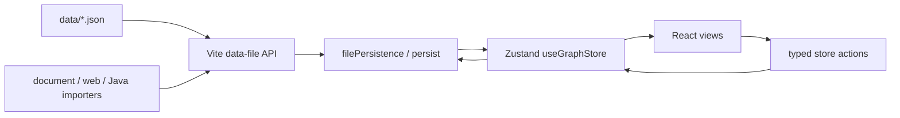

# Knowledge-OS 架构说明

> 最新状态：2026-08-05

## 架构目标

Knowledge-OS 使用一套类型化状态描述目录、知识节点、关系、问题和视图。状态只有一个运行时所有者，文件写入只有一条持久化路径，渲染组件不直接读写磁盘。

核心约束：

- `useGraphStore` 是渲染可见状态的唯一所有者。
- `data/*.json` 是跨会话的项目数据真源。
- 后台解析器只返回结构化结果，不直接修改 React 状态。
- 目录树与知识节点分离，正文不得复制到目录节点。
- 只持久化直接关系，传递关系在读取时推导。

## 数据流

写入采用临时文件加重命名，并按目标文件串行排队。这样可以避免并发保存互相覆盖，也不会让后台任务直接修改界面状态。

## 模块边界

| 模块 | 职责 |
| --- | --- |
| `src/store/useGraph.ts` | 应用状态、合法状态转换和持久化触发 |
| `src/knowledge/` | 领域模型、关系推导、树操作、时间线和导入客户端 |
| `src/core/` | 中央知识视图、解释索引和布局算法 |
| `src/core/explanation-index/` | 索引图布局、路由、画布和切割手势 |
| `src/layout/` | 顶栏、目录树与右侧详情面板 |
| `src/components/` | 独立工具视图与导入界面 |
| `src/panels/` | 当前知识点的解释、问题和关系展示 |
| `src/mechanism/` | 机制模型与可视化示例 |
| `scripts/import/` | 文档、网页和 Java 源码的确定性导入管线 |
| `vite.config.js` | 本地数据 API、导入 API 和文件写入队列 |

## 状态所有权

`PersistedAppState` 聚合目录树、节点池、关系边、问题、推理响应、时间线和视图配置。组件通过选择器读取状态，通过显式 action 请求修改，不允许跨组件直接变更数据。

主要标识均使用命名字段和类型：

- `TreeNode.nodeRef` 指向唯一知识节点。
- `KnowledgeEdge.source/target/type` 描述关系。
- `ExplanationSelection` 描述解释索引中的当前选择。
- `Question.source` 保留文档或网页来源。
- `KnowledgePointSnapshot` 描述时间线快照。

## 视图结构

应用外壳保持三栏布局：

- 左侧：目录树和目录操作。
- 中央：知识宇宙、解释索引、时间线、节点库、问题库、SuperTag 或机制视图。
- 右侧：解释正文、问题和系统连接图。

视图之间只通过 store action 和类型化选择进行通信。新增视图不应要求修改其他视图的内部状态。

## 导入边界

普通文档、网页和 Java 源码使用独立解析器，但最终写入同一组数据真源。解析、规范化、校验和落盘彼此分离；任何校验失败都必须发生在正式文件修改之前。

详细约束见 [文档导入标准](DOCUMENT_IMPORT_STANDARD.md)。

## 测试策略

测试保留在 `scripts/*.test.mjs`，重点覆盖：

- 领域函数和非法状态约束。
- 目录、关系和解释索引变更。
- 文档、网页与 Java 源码导入。
- 图布局、边路由、切割手势和系统连接图。
- 文件持久化边界与生产包数据隔离。

不再保留只匹配 CSS 类名、旧组件名称或大段源码字符串的历史快照测试。界面重构应通过行为测试或浏览器回归验证，而不是绑定具体实现文本。
