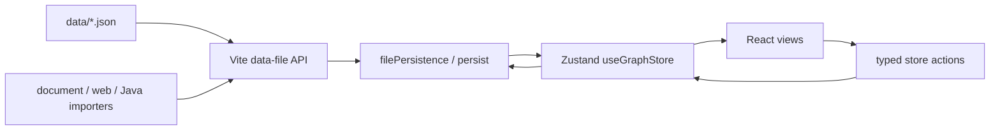

# Knowledge-OS 架构说明

> 最新状态：2026-09-24（已吸收原 `docs/PROJECT_INTRODUCTION.md` 的逻辑分层与核心模块盘点；分层文件数的统计时点为 2026-09-11，仅作量级参考）

## 架构目标

Knowledge-OS 使用一套类型化状态描述目录、知识节点、关系、问题和视图。状态只有一个运行时所有者，文件写入只有一条持久化路径，渲染组件不直接读写磁盘。

核心约束：

- `useGraphStore` 是渲染可见状态的唯一所有者。
- `data/*.json` 是跨会话的项目数据真源。
- 后台解析器只返回结构化结果，不直接修改 React 状态。
- 目录树与知识节点分离，正文不得复制到目录节点。
- 只持久化直接关系，传递关系在读取时推导。

## 逻辑分层

按依赖方向从外到内的 9 个逻辑层（文件数为 2026-09-11 统计，仅作量级参考）：

| 层 | 文件数 | 职责 |
| --- | --- | --- |
| 应用入口层 | 3 | `main.tsx` / `App.tsx` 启动与根布局装配 |
| 界面组件层 | 28 | `components/` 各类对话框、面板、选择器、视图 |
| 可视化引擎层 | 37 | `core/` + `mechanism/` 多维画布、解释索引、机制视图与布局渲染器 |
| 领域逻辑与状态层 | 33 | `knowledge/` + `store/` 核心业务 |
| 类型与样式基础层 | 12 | `types.ts`、`env.d.ts`、`styles/` 设计令牌 |
| 数据导入脚本层 | 20 | `scripts/import/` 各类导入流水线 |
| 数据层 | 8 | `data/*.json` 数据真源 |
| 配置与支撑层 | 8 | `package.json`、`tsconfig`、`vite.config` 等 |
| 文档层 | 3+ | 根目录与 `docs/` 的治理、架构与规范文档 |

**依赖枢纽**：`src/knowledge/` 是被引用最多的模块（100+ 条入边），是整张图的中心；`src/store/useGraph.ts` 是运行时状态的核心，拥有最高扇出。

## 数据流

```mermaid
flowchart LR
    Files["data/*.json"] --> Api["Vite data-file API"]
    Api --> Persistence["filePersistence / persist"]
    Persistence --> Store["Zustand useGraphStore"]
    Store --> Views["React views"]
    Views --> Actions["typed store actions"]
    Actions --> Store
    Store --> Persistence
    Importers["document / web / Java importers"] --> Api
```

写入采用临时文件加重命名，并按目标文件串行排队。这样可以避免并发保存互相覆盖，也不会让后台任务直接修改界面状态。

## 数据加载防护

`data/*.json` 从中间件进入 store 的链路上有四层防护（2026-09-11 落地）：

1. `src/knowledge/dataValidation.ts` 对每个切片做形状校验：错误信封 `{error:...}`、节点池缺 `label`/`card` 判 fatal；空 `tabs`、tab 缺 `content` 只聚合上报为 warning。
2. `src/knowledge/filePersistence.ts` 的 `fetchSlice` 返回 `loaded | missing | failed`，失败切片不进入 state。
3. `src/store/useGraph.ts` 维护 `blockedSlices` 与 `dataLoadReport`，失败切片禁止回写（进不了持久化 baseline）；提供 `reloadFromFiles` 重新拉取。
4. 渲染层由 `src/components/ErrorBoundary.tsx`（中间视图与右栏各一）和常驻的 `DataLoadBanner.tsx` 兜底，单点异常不再白屏整页。

## 模块边界

| 模块 | 职责 |
| --- | --- |
| `src/store/useGraph.ts` | 应用状态、合法状态转换和持久化触发 |
| `src/knowledge/` | 领域模型、关系推导、树操作、时间线和导入客户端 |
| `src/core/` | 中央知识视图、解释索引和布局算法 |
| `src/core/explanation-index/` | 索引图布局、路由、画布和切割手势 |
| `src/layout/` | 顶栏、目录树与右侧详情面板 |
| `src/components/` | 独立工具视图与导入界面 |
| `src/panels/` | 当前知识点的解释、问题和关系展示 |
| `src/mechanism/` | 机制模型与可视化示例 |
| `scripts/import/` | 文档、网页和 Java 源码的确定性导入管线 |
| `vite.config.js` | 本地数据 API、导入 API 和文件写入队列 |

## 核心模块详述

### `src/knowledge/` — 领域逻辑
知识领域最密集的代码：状态（`state.ts`）、目录树绑定（`treeBinding.ts`、`treeUtils.ts`）、类型关系（`typeRelations.ts`）、解释索引（`explanationIndex.ts`、`explanationTree.ts`、`explanationTable.ts`）、投影（`projection.ts`、`physicalProjection.ts`）、超标签（`supertags.ts`）、导入（`documentImport.ts`、`linkImport.ts`）、持久化（`filePersistence.ts`、`persist.ts`）。

### `src/store/useGraph.ts` — 全局状态
单一 Zustand store，集中管理节点、边、树、时间线、题库与持久化，是运行时数据流的唯一出口；含数据加载防护（`blockedSlices` / `dataLoadReport`，失败切片禁止回写）与 `reloadFromFiles`。

### `src/core/` — 可视化引擎
`DimensionCanvas.tsx`（多维知识画布枢纽）、`ExplanationIndexView.tsx`（解释索引视图），以及六种布局渲染器（stack / grid / tree / chain / matrix / btree，位于 `sections/`）。

### `src/mechanism/` — 机制视图
把知识图谱投影为「机制」流程图/序列图：`core.ts`（领域类型）、`diagram.ts`（帧投影）、`lens.ts`（图/时间线/场景三种镜头）、`knowledgeProjection.ts`（图谱→机制模型）、`validation.ts`（结构校验），外加 InnoDB、Java 线程生命周期、MySQL UPDATE 等示例数据。

### 知识演化时间线（时态索引）
`knowledge/timelineEvolution.ts`（核心引擎，定义 `TimelineFacet` 语义面与 `KnowledgeTimelineEvent`，`buildKnowledgeTimeline` 聚合快照与标注）、`knowledge/timelineAnnotations.ts`（精选标注数据，如 Spring 4/5 演化）、`knowledge/indexEvolution.ts`（索引视图投影，累积揭示新增节点）、`core/TemporalIndexWorkspace.tsx`（时态索引工作区：同一张统一索引图叠加时间轴、事件抽屉与节点态切片，读历史时进入只读门禁）。

### `src/panels/` 与 `src/layout/`
`panels/` 承载各功能面板（解释卡片、题库、关系网络、系统连接图）；`layout/` 承载 `TopBar`、`UniverseTree`（知识宇宙树）、`RightSidePanel`。

## 状态所有权

`PersistedAppState` 聚合目录树、节点池、关系边、问题、推理响应、时间线和视图配置。组件通过选择器读取状态，通过显式 action 请求修改，不允许跨组件直接变更数据。

主要标识均使用命名字段和类型：

- `TreeNode.nodeRef` 指向唯一知识节点。
- `KnowledgeEdge.source/target/type` 描述关系。
- `ExplanationSelection` 描述解释索引中的当前选择。
- `Question.source` 保留文档或网页来源。
- `KnowledgePointSnapshot` 描述时间线快照。

时间线使用两层模型：`KnowledgePointSnapshot` 是可持久化的原始观察，`timelineEvolution` 在读取时按时间批次聚合，并把变化压缩为内容、结构、元数据和视图投影四个语义面。时间线组件只读取这个通用投影，不把 Spring 或其他领域的版本说明写回节点池；跨节点改进可以通过 `TimelineAnnotation` 作为可复用数据输入。

## 视图结构

应用外壳保持三栏布局：

- 左侧：目录树和目录操作。
- 中央：知识宇宙、解释索引、时间线、节点库、问题库、SuperTag 或机制视图。
- 右侧：解释正文、问题和系统连接图。

视图之间只通过 store action 和类型化选择进行通信。新增视图不应要求修改其他视图的内部状态。

## 导入边界

普通文档、网页和 Java 源码使用独立来源适配器（`scripts/import/`，共享引擎在 `scripts/import/lib/`），经确定性解析与校验后直接原子写入数据真源。任何校验失败都必须发生在正式文件修改之前。

导入流水线清单：

- `document-importer.mjs` — 通用文档导入入口（自动 / 文章 / 题库三种结构）
- `java-source-importer.mjs` + `JavaSourceIntrospector.java` — JDK Compiler Tree API 源码解析
- `web-link-importer.mjs` + `link-import-api.mjs` — 网页 / GitHub / Wikipedia 导入
- `mineru-ocr.mjs` — 扫描 PDF 的本地 OCR 导入
- `lib/import-jdk-collections.mjs` / `lib/import-wikipedia.mjs` — JDK 集合与 Wikipedia 专用导入

Markdown 是无损传输格式，不是知识模型。标题、段落、列表、表格和代码块只是解析证据。知识节点必须可独立寻址；`structure` 与 `classification` 关系可用于生成目录导航，因果、依赖、状态转换等关系不得被伪装成目录父子；目录树只是导航投影，不能反向定义知识关系。

> 历史：曾存在一条「语义草稿 → 图投影 → 多根写入」的导入链（`semantic-draft.mjs` / `semantic-projector.mjs` / `semantic-persistence.mjs` / `ai-organizer.mjs`），2026-09-10 判定从未成功沉积并整链移除。该方向的领域约束仍记录在 [文档导入标准](DOCUMENT_IMPORT_STANDARD.md) 与 `CONTEXT.md`，未来若重做需按约束重新设计。

详细约束见 [文档导入标准](DOCUMENT_IMPORT_STANDARD.md)。

## 测试策略

测试保留在 `scripts/*.test.mjs`，重点覆盖：

- 领域函数和非法状态约束。
- 目录、关系和解释索引变更。
- 文档、网页与 Java 源码导入。
- 图布局、边路由、切割手势和系统连接图。
- 文件持久化边界与生产包数据隔离。
- 数据切片形状校验（`dataValidation`，含错误信封与时间戳类型）。

不再保留只匹配 CSS 类名、旧组件名称或大段源码字符串的历史快照测试。界面重构应通过行为测试或浏览器回归验证，而不是绑定具体实现文本。

浏览器级验收脚本（P0 防护、锁矩阵、answerSteps 等）已在使用后移除，验收结论沉淀在 `outputs/` 与工作日志；同范式脚本可按 `git log -- scripts/verify-*.mjs` 找回。

## 机制视图投影

机制视图不是独立的数据域，也不维护模型注册表。`src/mechanism/knowledgeProjection.ts` 只把统一知识图中已经表达出动态规律的部分投影为机制运行时模型；普通知识不会因为存在一条关联边就自动变成机制：

- `KnowledgeNode.kind = mechanism` 标记机制根；机制内部的状态、实体、事件和规则仍是普通知识节点。
- 机制根必须持有 `MechanismSpec`，声明现象、触发、参与者、状态、转移、约束、结果和失败路径；`validateMechanismSpec` 负责拒绝不完整机制。
- `focusNodeId` 可以指向机制根或机制成员；成员会沿目录路径回溯到所属机制根。
- `KnowledgeEdge.relationKind` 区分结构、分类、依赖、因果、状态转移、约束、证据和引用。
- 只有 `causality` / `state-transition` 才能生成过程步骤；`structure` / `constraint` 只参与机制结构与上下文。
- `selectedNodeId` 只负责当前高亮和右侧详情，不改变机制上下文。
- 机制图、流程图和时序图共同读取同一组已分类关系边。
- 播放位置和图形模式是视图局部状态，不写回知识数据。

因此，导入器负责写入知识节点的性质和关系的语义；机制视图只解释其中的动态规律，不允许再为某个主题新增 TypeScript 机制模型。

Java 类加载使用同一契约表达：请求事件触发状态链，加载器、字节码和运行时 Class 是参与者，父委派、类身份和初始化锁是约束，初始化成功与链接/初始化失败是结果分支。
