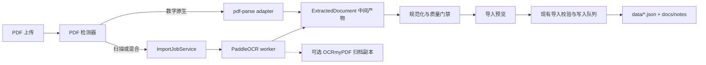

# PDF 扫描件转换与导入方案调研

> 调研日期：2026-08-09

> 实施决策：已选择 MinerU 3.4.4 作为首个本地 OCR provider。当前实现使用隔离的 `.venv-mineru` 和 `pipeline` 后端；本文原始工具比较保留为决策背景。

## 结论

Knowledge-OS 不应把“扫描设备接入、OCR、版面恢复、知识导入”合成一个工具或一个函数。

建议采用分层方案：

1. 扫描采集继续由外部工具完成，Windows 首选 NAPS2；系统只接收 PDF 文件。
2. 数字原生 PDF 继续使用现有 `pdf-parse` 快速通道。
3. 扫描 PDF 和混合 PDF 使用独立 OCR worker，首选 PaddleOCR PP-StructureV3。
4. OCR worker 只生成结构化中间产物，不直接修改 `data/*.json` 或 React 状态。
5. 中间产物经过规范化、质量门禁和用户确认后，再复用现有 `prepareDocumentImport` / `importDocument` 的校验和单路写入边界。
6. OCRmyPDF 适合作为“生成可搜索归档 PDF”的可选后处理，不应作为知识结构提取器。
7. Docling、MinerU 和云 OCR 暂时保留为替换型 provider，不在第一阶段同时接入。

首期只实现一个本地 OCR provider。多 provider 会引入配置、状态、错误语义和回归矩阵，当前收益不足以覆盖维护成本。

## 当前系统审计

### 已有能力

- `scripts/import/document-importer.mjs` 使用 `pdf-parse` 提取 PDF 文本，清理重复页眉页脚，并用规则识别章节标题。
- `scripts/import/link-import-api.mjs` 通过 `/api/import-document` 接收原始文件，请求内同步完成解析和导入。
- 导入前会生成草稿并执行确定性校验；失败时不应修改正式数据。
- 正式数据仍由现有导入器写入 `data/node-pool.json`、`data/tree-data.json`、`data/questions.json` 和 `docs/notes/`。
- `scripts/ocr/ocr-redis-pdf.py` 已验证 RapidOCR 可以识别中文扫描页，并支持逐页恢复执行。

### 当前缺口

- PDF 文件上限为 20 MB；仓库现有的《Redis 设计与实现》扫描样本为 65.5 MB、406 页，无法从现有界面导入。
- `parsePdfDocument` 在提取文本少于 20 个非空白字符时直接拒绝扫描件。
- 请求是同步长事务，没有 OCR 进度、取消、恢复和独立资源隔离。
- RapidOCR 脚本将页面压平成字符串，未保留坐标、块类型、表格、图注、图片引用和识别置信度。
- 当前样本包含章节标题、代码字体和流程图。纯文本 OCR 会把流程图节点混入正文阅读顺序，也无法建立“图 1-1”和图片资产之间的引用。
- OCR 脚本硬编码输入、输出路径，且当前环境没有稳定的项目级 Python 运行时声明。

因此，不能只在 `parsePdfDocument` 内增加一次 OCR 命令调用。那会让解析、进程管理、缓存、进度和正式写入继续耦合在一个请求中。

## 工具比较

| 工具 | 最适合的职责 | 中文扫描 | 版面/表格 | 本地运行 | 集成判断 |
| --- | --- | --- | --- | --- | --- |
| PaddleOCR PP-StructureV3 | PDF/图片到结构化块、Markdown、JSON | 强 | 强，覆盖表格、公式、图片、版面区域 | 是 | **首选语义提取器** |
| OCRmyPDF | 给扫描 PDF 添加可搜索文字层，纠偏、旋转、清理 | 依赖 Tesseract 语言包 | 弱，不负责知识结构恢复 | 是 | 可选归档后处理 |
| Docling | 多格式文档统一转换、Markdown/JSON 导出 | 可配置 OCR，但中文路径仍需基准验证 | 强 | 是 | 后续候选，不作为首期默认 |
| MinerU | 复杂 PDF 到 Markdown/JSON，面向 LLM 数据准备 | 强 | 强 | 是，但依赖和资源较重 | 效果候选，先做许可证和资源审计 |
| NAPS2 | 扫描仪采集、批量扫描、OCR、可搜索 PDF | 可用 | 以扫描输出为主 | 是 | 外部采集工具，不进入核心导入器 |
| Azure Document Intelligence / AWS Textract | 托管 OCR、表格和表单提取 | 强 | 强 | 否 | 隐私、成本和供应商依赖可接受时的显式备选 |
| ABBYY FineReader PDF | 人工操作、校对和高质量办公格式转换 | 强 | 强 | 桌面软件 | 适合人工修复，不适合作为默认自动化后端 |

### 为什么首选 PaddleOCR PP-StructureV3

- 官方管线直接面向复杂文档解析，不只返回 OCR 行文本。
- 可以输出结构化 JSON 和 Markdown，适合先映射到系统自己的中间表示，再生成 Knowledge-OS 草稿。
- 中文是其核心使用场景，且开源许可证和本地部署方式更适合私有知识库。
- 可以单独部署为 Python 子进程或服务，不要求把模型加载到 Vite/Node 进程。

需要注意：PP-StructureV3 是一组模型管线，不应假设当前 RTX 3060 Laptop 6 GB 和 16 GB 内存可以无条件运行全部高配模型。正式接入前必须用项目语料比较 CPU、GPU、显存占用和每页耗时，并把并发固定为 1。

### 为什么不把 OCRmyPDF 作为主提取器

OCRmyPDF 的核心价值是保留原 PDF 外观并添加文字层，同时提供旋转、纠偏和图像清理。它能让扫描 PDF 被搜索，也能让现有 `pdf-parse` 读到文字，但它不解决下列问题：

- 多栏阅读顺序；
- 表格结构；
- 流程图和图注关联；
- 标题、正文、代码、页眉页脚的块类型；
- 块级置信度和坐标。

因此它可以产生 `searchable.pdf` 归档副本，但语义导入仍应消费结构化 OCR 结果。

### 为什么暂不同时接入 Docling 和 MinerU

两者都很有价值，但当前系统只需要解决扫描 PDF 这一条明确链路。首期同时接入会带来：

- 多套安装和模型下载；
- 多套结果结构适配；
- provider 选择 UI；
- 不同错误、进度和取消语义；
- 更大的基准和回归测试矩阵。

更合理的做法是先定义稳定的 `ExtractedDocument` 契约。只有 PaddleOCR 达不到验收线时，再以同一契约替换或增加 provider。

## 推荐架构



### 1. PDF 检测器

检测器只读文件并返回分类，不做 OCR：

- 是否为有效 PDF；
- 是否加密；
- 页数和页面尺寸；
- 每页可提取字符数；
- 文字页、图片页和混合页比例；
- 是否存在异常超大页面或渲染像素风险。

分类应使用枚举，而不是散落的字符串判断：

```ts
export enum PdfContentKind {
  BornDigital = 'born-digital',
  Hybrid = 'hybrid',
  Scanned = 'scanned',
}
```

混合 PDF 必须按页路由：有可靠文本层的页面保留原文，缺少文本层的页面才 OCR，避免重复识别降低质量。

### 2. 结构化中间表示

OCR provider 不应直接输出最终 Markdown。先保留版面语义，再由一个确定性 renderer 生成 Markdown：

```ts
export enum DocumentBlockKind {
  Heading = 'heading',
  Paragraph = 'paragraph',
  List = 'list',
  Code = 'code',
  Table = 'table',
  Figure = 'figure',
  Caption = 'caption',
  Formula = 'formula',
  Header = 'header',
  Footer = 'footer',
}

export interface DocumentBlock {
  id: string;
  pageNumber: number;
  kind: DocumentBlockKind;
  readingOrder: number;
  boundingBox: readonly [number, number, number, number];
  confidence: number | null;
  text: string | null;
  markdown: string | null;
  assetPath: string | null;
}

export interface ExtractedDocument {
  sourceHash: string;
  contentKind: PdfContentKind;
  title: string;
  language: string;
  pageCount: number;
  blocks: DocumentBlock[];
  warnings: ExtractionWarning[];
}
```

`DocumentBlock` 是 OCR 层和现有知识导入层之间唯一的共享契约。PaddleOCR、Docling、MinerU 或云服务的原始 JSON 都必须先适配到它，不能让 provider 字段渗透到 `buildWebNodes`。

### 3. ImportJobService

OCR 是长任务，不能继续占用 `/api/import-document` 的单次同步事务。新增服务只拥有导入任务状态：

```text
queued -> inspecting -> extracting -> normalizing -> review-ready
review-ready -> committing -> succeeded
任何执行状态 -> failed | cancelled
```

约束：

- worker 只读取暂存 PDF，写入暂存产物，并发送类型化进度消息；
- worker 不读取或修改 `data/*.json`；
- `ImportJobService` 是任务状态的唯一所有者；
- 只有 `committing` 阶段进入现有 `enqueueImport` 写入队列；
- 失败或取消时删除未提交的临时文件；
- 同一 `sourceHash` 默认复用成功的提取产物，用户显式要求时才重新 OCR；
- 本机 OCR 并发固定为 1，避免模型和页面渲染争抢内存。

首期 API 保持窄表面：

```text
POST   /api/import-jobs
GET    /api/import-jobs/:id
DELETE /api/import-jobs/:id
POST   /api/import-jobs/:id/commit
```

不需要首期实现任务列表、优先级、批量队列、云同步或多用户调度。

### 4. 暂存与正式存储

建议把未提交产物放在被 Git 忽略的显式目录：

```text
.knowledge-os/import-jobs/<job-id>/
  source.pdf
  inspection.json
  extraction.json
  preview.md
  assets/
```

目录由 `ImportJobService` 单独管理，并具有明确生命周期。正式提交后：

- 规范化正文仍写入 `docs/notes/`；
- 节点、目录、问题仍写入现有 `data/*.json`；
- 需要保留的图片复制到一个明确的文档资产目录；
- 原始 PDF 是否长期保留应作为单独产品决策，首期默认不复制进仓库，只记录来源哈希和原文件名。

### 5. 质量门禁

扫描件不能只用“识别到了字符”作为成功条件。建议在现有 `validateDocumentDraft` 前增加提取质量报告：

- 空白页比例；
- 平均和最低块置信度；
- 低置信度字符比例；
- 页眉页脚重复检测；
- 阅读顺序异常；
- 标题层级是否连续；
- 表格是否有结构化单元格；
- 图片是否有图注或附近引用；
- OCR 页数是否等于预期页数。

低于门禁时任务进入 `review-ready` 并显示警告，不能静默写入正式知识库。

## 基准方案

在选择模型参数前建立一个小而稳定的黄金语料，不以仓库 star 或单页演示做决策。

建议包含 5 类文档，每类抽取 3 至 5 页：

1. 中文技术书正文和章节标题；
2. 含流程图、图注和正文引用的页面；
3. 表格密集页面；
4. 中英混排代码、命令和标识符；
5. 倾斜、噪点、低对比度或双页扫描。

指标：

- 中文 CER；
- 英文/代码 WER；
- 标题识别 F1；
- 阅读顺序正确率；
- 表格结构准确率；
- 图注关联正确率；
- 每页耗时；
- 峰值 RAM 和 VRAM；
- 406 页样本的失败恢复能力。

首期验收不要求所有指标完美，但必须满足：

- 任务失败不会修改正式数据；
- 取消后没有遗留 worker；
- 同一 PDF 重试可以复用已完成页面；
- 流程图文字不会被无提示地拼入正文；
- 低质量页面在提交前可见；
- 现有数字原生 PDF 导入测试不回归。

## 分阶段实施

### Phase 0：离线基准

- 固定黄金页和人工真值。
- 比较当前 RapidOCR、PaddleOCR PP-StructureV3，以及一个备选工具。
- 确认适合本机的模型组合、运行时和资源上限。
- 先解决 Python 环境可重复安装，再写产品代码。

### Phase 1：最小生产链路

- 增加 PDF 检测器和 `ExtractedDocument` 契约。
- 数字原生 PDF 仍走现有快速路径。
- 扫描 PDF 由单进程 PaddleOCR worker 转为结构化中间产物。
- 提供进度、取消、失败清理和预览。
- 复用现有确定性校验与提交队列。

### Phase 2：质量与恢复

- 增加页级缓存、断点恢复和质量报告。
- 保存表格、图片、图注和页面来源引用。
- 对现有 406 页扫描书完成端到端回归。

### Phase 3：可选扩展

- 用户明确需要可搜索归档 PDF 时接入 OCRmyPDF。
- 本地质量无法达标且隐私允许时，增加一个云 provider。
- 只有基准证明明显收益时，才评估 Docling 或 MinerU 替换默认 provider。

## 不建议的方案

- **把 RapidOCR 脚本直接挂到上传接口**：没有结构化输出、任务边界和可重复运行时。
- **所有 PDF 都强制 OCR**：会破坏数字原生文本，增加耗时和识别错误。
- **OCR 完成后直接写 `data/*.json`**：违反单一写入路径，失败时难以保证原子性。
- **首期集成扫描仪驱动**：TWAIN/WIA、设备状态和桌面权限会形成新的独立领域，偏离知识导入核心。
- **用 LLM 修复整本 OCR 后再入库**：成本不可控、结果不确定，也会掩盖底层版面错误。LLM 只能在确定性提取后做可选整理。
- **同时支持多个 OCR provider**：在没有基准证明必要性前，只会放大维护表面。

## 官方资料

- [OCRmyPDF introduction](https://ocrmypdf.readthedocs.io/en/latest/introduction.html)
- [OCRmyPDF installation](https://ocrmypdf.readthedocs.io/en/latest/installation.html)
- [PaddleOCR PP-StructureV3](https://www.paddleocr.ai/latest/en/version3.x/pipeline_usage/PP-StructureV3.html)
- [Docling documentation](https://docling-project.github.io/docling/)
- [MinerU repository](https://github.com/opendatalab/MinerU)
- [NAPS2 command line](https://www.naps2.com/doc/command-line)
- [NAPS2 OCR](https://www.naps2.com/doc/ocr)
- [Azure Document Intelligence Read model](https://learn.microsoft.com/en-us/azure/ai-services/document-intelligence/prebuilt/read)
- [Amazon Textract](https://docs.aws.amazon.com/textract/latest/dg/what-is.html)
